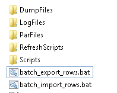

====================
Azure Migration Plan
====================

Abstract
========

The following document explains, in some detail, the steps required to 
migrate the current Solaris 9i database to Windows Azure running 
Oracle 11g - specifically release 11.2.0.4.

**NOTE: All** database work must be carried out with the following
settings in the Windows cmd session:

..  code-block:: batch

    set oracle_sid=<database being worked on>
    set oracle_home=C:\OracleDatabase\product\11.2.0\dbhome_1
    set nls_lang=american_america.we8iso8859p1
    set nls_date_format=

or

..  code-block:: batch

    oraenv <database being worked on>
    set nls_date_format=

***``NLS_DATE_FORMAT`` must be unset or the NOROWS import will fail
due to a badly defined column default value which uses a date format
that is not necessarily the one you may wish to define.***

Important Notes
===============

**All scripts, parameter files etc are assumed to be located in a tree
structure, similar to the following, beneath a parent 'root' folder:**

|TreeImage|

-  The **'root'** folder is the parent of the others, and is the
   location where all SQL scripts write their log files to.

-  **DumpFiles** Holds the uncompressed export files and logs from the
   production database exports.

-  **LogFiles** is where the various import jobs write their logfiles.

-  **ParFiles** is where the import jobs read their parameter files
   from.

-  **RefreshScripts** is where the various scripts used in the refresh
   are to be found. Some scripts here call scripts in the **Scripts**
   folder.

-  **Scripts** is where the common scripts and output from the
   production reconciliation scripts etc. Also here are scripts that
   must be generated by the production DBAs and are required to be run
   on the migrated database after the migration has completed.

The image above shows the view, as it were, from the root
directory\ ***. It is from this root directory that everything in the
following document takes place.***

Production DBA Tasks
====================

-  **Ensure receipt** of most recent copies of the scripts to generate
   the package that creates the export parameter files. These can change
   from time to time and the latest version must be used. The supporting
   documentation must also be supplied. The scripts are in TFS at
   location $/TA/DEV/Projects/Oracle Upgrade 9i to
   11g/UKRegulated/Database/DBA Documentation/Code/ExportParfileScripts.

-  **Ensure receipt** of the current database reconciliation scripts.
   Again, these might be changed and the latest version must be used.
   The scripts are in TFS at location $/TA/DEV/Projects/Oracle Upgrade
   9i to 11g/UKRegulated/Database/DBA
   Documentation/Code/ITReconcilliationScripts.

-  **Create the export parameter files**:

   -  exp\_NOROWS.par - Everything, for all users, *except* the actual data in the tables.
   -  exp\_NOFCS.par - Data for all users *except* FCS.
   -  exp\_FCS1.par - ``FCS.AUDIT_LOG_DETAIL`` only.
   -  exp\_FCS2D.par - A large number of small to medium sized FCS tables.
   -  exp\_FCS3.par - ``FCS.ORDTRAN`` only.
   -  exp\_FCS4.par - ``FCS.STP_MESSAGES`` only.
   -  exp\_FCS5.par - ``FCS.AUDIT_LOG`` only.
   -  exp\_FCS6.par - A few larger FCS tables.
   -  exp\_FCS7.par - All other tables, including any recently added, not exported in the other files.
   -  exp\_FCS8.par - ``FCS."UKFATCASubmissionFIRe98_TAB"`` and ``FCS.EMAIL_ATTACHMENT`` only.
   -  exp\_FCS9.par - ``FCS.XML_FATCA_REPORTS`` only.

-  The production DBAs should **stop all processes** that connect to the
   production database prior to the exports being run.

-  **Run script** *S095\_RecreatePUBLICDatabaseLinks.sql* to generate a
   script, *T095\_RecreatePublic\_DB\_Links.sql*, which rebuilds the
   PUBLIC database links. This is run as part of the *PreRefresh*
   script. The output needs to be sent to the Leeds DBAs.

-  **Run the reconciliation scripts**, and supply the results to the Leeds
   DBAs, before exporting the database. These scripts are documented in
   "*UV Database Migration Guide*" which can be found in TFS at location
   $/TA/DEV/Projects/Oracle Upgrade 9i to
   11g/UKRegulated/Database/Upgrade Documentation.

-  **Export the database** using in above parameter files. Run these in
   parallel to reduce the overall run time.

-  As each export completes, **check the logfile** for problems and fix as
   necessary. If there are no problems, **zip up the dump file** and **SFTP to
   the appropriate Azure server**. Please also **SFTP the logfile**.

Leeds DBA Tasks
===============

-  **Ensure all required *'RefreshScripts'* scripts have been copied
   from TFS, to the server**. The scripts are in TFS at location
   $/TA/DEV/Projects/Oracle Upgrade 9i to 11g/UKRegulated/Database/DBA
   Documentation/Code/migrationRootFolder. These should be checked out
   and copied to the appropriate database server in Azure.

-  Also, **check out and copy the 'Scripts'** folder, from the same TFS
   location, to the database server.

-  Copy the supplied reconciliation scripts output from the Production
   DBAs, into the 'Scripts' folder, overwriting anything that is already
   there.

-  Make sure that any/all previous runs/test/etc have had their log
   files etc removed from the root of the migration folder, and the
   logfiles folder.

-  **Make sure** that the ``NOROWS``, ``NOROWS_GRANTS`` and ``NOFCS`` import
   parameter files are edited to ensure that **full=y** has been used
   instead of **FROMUSER**.

-  **Make sure** that all the import parameter files are edited to ensure 
   that the correct FCS username and password are used in the **USERID** 
   parameter..

-  **Disable Data Guard, if running.** This is unlikely to be necessary.
   However, if it is required to do so, then the steps are outlined in
   the document "*AZURE – Using RMAN to create standby databases.docx*"
   which is in TFS at location $/TA/DEV/Projects/Oracle Upgrade 9i to
   11g/UKRegulated/Database/DBA Documentation/RMAN Cloning to Standby.
   The appropriate section is entitled **Stopping Managed Recovery**.

-  **If you wish**, before starting SQL\*Plus for the following scripts,
   save yourself having to type in "RefreshScripts\\" or "Scripts\\" all
   the time by running the following ``set SQLPATH`` command, replacing
   '?' by the appropriate drive letter.

   ..  code-block:: batch

         set SQLPATH=?:\Migrationroot\refreshscripts;?:\Migrationroot\scripts

-  Change to the MigrationRoot folder:

   ..  code-block:: batch

         cd ?:\MigrationRoot

-  **Edit the script** (supplied by the production DBAs)
   *Scripts\\T095\_RecreatePublic\_DB\_Links.*\ sql to remove the
   CFGTEST database link.

-  **Edit the script** supplied by the production DBAs,
   *Scripts\\T150a\_create\_roles.sql*. Look for "**alter user fcs**"
   (near line 1550) and check that the entire command is on one line –
   because the script that generated it didn't set lines wide enough, it
   has wrapped - The text ``AD_ROLE,COMMS_ROLE,WEB_USER`` may be on a
   second line, and this breaks the SQL. Make it a single line if
   necessary.

-  Set the oracle environment and start SQL\*Plus as SYSDBA

   .. code-block:: batch

         oraenv <database_name>
         set NLS_DATE_FORMAT=

         sqlplus sys/password as sysdba

-  **Run the ShutDownRestart script.** The script
   *RefreshScripts\\ShutDownRestart.sql* must be run in order to prepare
   the database for the migration.

   ..  code-block:: sql

         @ShutDownRestart.sql

   It will:

   -  Shutdown and MOUNT the database;

   -  Disable flashback mode;

   -  Disable Archivelog mode;

   -  Open the database for use.

-  **Run the preRefresh script.** There is a script named
   *RefreshScripts\\preRefresh.sql* which must be executed using
   SQL\*Plus before any other work is carried out on the Azure server.
   
   ..  code-block:: sql

         @preRefresh.sql

   This script will delete and recreate the desired users and set up any
   required initial grants and privileges to those (new) users.

-  **Check logfiles created:**

   -  *create\_profiles.lst*
   -  *PreRefresh.lst*
   -  *Grants.lst*
   -  *DropPublicDBLinks.lst*
   -  *T095\_recreatePublic\_DB\_links.lst*
   -  *Drop\_old\_users.lst*
   -  *Drop\_old\_users\_2.lst*
   -  *create\_users\_and\_roles.lst*
   -  *create\_tablespace\_quotas.lst*
   -  *create\_system\_privs.lst*
   -  *create\_proxies.lst*
   -  *create\_roles.lst*

-  The Production DBAs will have placed zipped copies of all the export
   files onto the SFTP location on the production servers. **Unzip the
   export files on Azure.** On the Azure servers, the export files must
   be placed in the "*DumpFiles*" folder previously created for this
   purpose. The files should be unzipped using 7Zip as opposed to WinZip
   as 7Zip is by far the faster of the two utilities.

-  **Check the logfiles for any errors.** It is possible that the
   production DBAs overlooked one or more errors in the export. As a
   sanity check, it is advisable to scan the files for any errors. This
   can be automated to a degree by running the following command:

   ..  code-block:: batch

         find /I "EXP-" \*.log

   Any errors will be listed along with the logfile that the error was
   found in.

-  **Import NOROWS dumpfile.** This file recreates the empty structure
   of the database accounts. It is imported by running the following
   command:

   ..  code-block:: batch

         set nls_date_format=
         imp parfile=parfiles\imp_NOROWS.par

   When complete, check the logfile, as above, for any errors. These
   must be repaired before continuing.

    ..  code-block:: batch

          find /i "imp-" logfiles\imp_NOROWS.log | find /v /i "00041" | find /v "encountered"

    -  Error IMP-00015 for public synonym ``PRODUCT_IMPL`` can be ignored.

    -  Error 2270 for ``XML_FATCA_REPORTS`` can be ignored.

    -  Error 12014 for ``CREATE SNAPSHOT LOG`` on ``INVESTOR`` and ``ORDTRAN`` can be
       ignored.

    -  Error 6564 for any table named ``EXT_%`` can be ignored as directory
       ``THREAD_EXT_TABLES`` is no longer created. (These ``EXT_%`` tables are later
       deleted anyway.)

-  **Run the post\_Import\_norows script.** Using SQL\*Plus, connect as
   the SYS user and execute the
   *RefreshScripts\\post\_import\_norows.sql* script:
   
   .. code-block:: batch

        sqlplus sys/password as sysdba

   .. code-block:: sql

        @post_import_no_rows.sql
         
   This script will:

   -  Issue required grants;
   -  Recompile some invalid objects;
   -  Disable various triggers;
   -  Configure some database parameters prior to the main imports.
   -  Drop some XML stuff that breaks the imports;
   -  Drops some packages that audit the imports and cause them to take
      much longer;
   -  Drops 9i specific Materialized Views and snapshots;
   -  Drops the existing ``DBMS_JOBS`` for the FCS user.

-  **Run the various ROWS imports.** A script has been supplied to
   execute the required parallel imports - *batch\_import\_rows.bat* –
   see below *before* executing it. Please note that FCS9 will *not* be
   imported as it always fails. FCS8 will usually fail at the last table
   too. These are resolved below.

   **The script *must* be executed in a DOS session, and is named
   *batch\_import\_rows.bat*. It will take care of submitting all the
   required imports. If you only double-click the file in Explorer,
   then everything will appear and vanish in a flash, *and will not
   work*.**

   **Using a Toad Session Browser, make sure that none of the import
   sessions end up waiting for a "*SQL\*Net message from client*" for a
   long period of time, a few seconds is fine, but longer may indicate
   that that session's DOS window has gone into SELECT mode and will
   prevent the import from writing to the screen. This will hang the
   import session.**

   **If a session does enter SELECT mode, click its window, and hit the
   RETURN key a few times until refreshing Toad shows that the session
   is no longer waiting.**

   You can use the following script to get a pretty good idea of how
   fast things are progressing. It may barf with a divide by zero error
   if a table hasn't imported any rows yet, just run it again after a
   couple of seconds if this results. (It will work, soon! Keep
   trying.)

   .. code-block:: sql

        -- How fast is my import running?
        -- BEWARE, sessions that are creating indexes
        -- will show a decreasing "rows per minute" figure as there
        -- are no more rows importing, but time is still passing!
        --

        set lines 2000 pages 2000 trimspool on

        col table_name for a31
        col index_name for a31

        select  substr(sql_text,instr(sql_text,'INTO "')+6,instr(sql_text, '(') - instr(sql_text,'INTO "') -8) table_name,
                null index_name,
                rows_processed,
                round((sysdate-to_date(first_load_time,'yyyy-mm-dd hh24:mi:ss'))*24*60,1) minutes,
                trunc(rows_processed/((sysdate-to_date(first_load_time,'yyyy-mm-dd hh24:mi:ss'))*24*60)) rows_per_min
        from    sys.v_$sqlarea
        where   sql_text like 'INSERT %INTO "%'
        and     command_type = 2
        and     open_versions > 0
        --
        union all
        --
        select  replace(substr(sql_text,instr(sql_text,'ON "')+4,instr(sql_text, '(') - instr(sql_text,'ON "') -6),'"', null) table_name,
                replace(substr(sql_text,instr(sql_text,'INDEX "')+7,instr(sql_text, ' ON') - instr(sql_text,'INDEX "') -8),'"', null) index_name,
                null rows_processed,
                round((sysdate-to_date(first_load_time,'yyyy-mm-dd hh24:mi:ss'))*24*60,1) minutes,
                null rows_per_min
        from    sys.v_$sqlarea
        where   sql_text like 'CREATE %INDEX%'
        and     command_type = 9
        and     open_versions > 0
        --
        -- List the table first, then the index creation, if any.
        order   by 1, 2 nulls first;

-  **Potential Problem 1:** There are two XML tables which rely on a
   cascade of different XML types. One is in the **FCS8** import, the other 
   is in the *unused* **FCS9** import. These types have an
   internal OID (Object ID) and on the import, these are recreated so
   the tables subsequently refuse to import as they "require" a
   different OID for the various Types. In addition, one table has a
   mixed case name.

   The Oracle workaround for this problem doesn't appear to work.

   **In general, if one of these two tables fails to import, there will
   be problems with the other. See below for the fixes.**

   In the event of any XML problems in **FCS8**,
   the fixes, which are detailed below, should be run *after* the end
   of the *NOROWS\_GRANTS* import, and *before* the start of the
   *post\_import\_rows* script.
    
   **Note**: The export file for the FCS9 import will be used however, it's only
   the FCS9 import parameter file that will not be used.

-  **Potential Problem 2:** FCS6 *might* fail to create index
   ``ALERT_LOG_PK`` due to ``ALERT_LOG_SEQ`` duplicates *somehow* created by
   the ``PK_ALERTS.RUN_HEARBEAT`` scheduled job. If this happens, find the
   duplicates as follows:

   .. code-block:: sql

        select alert_log_seq,count(*)
        from fcs.alert_log
        group by alert_log_seq
        having count(*) > 1
        order by alert_log_seq;

   Then, for each duplicate alert\_log\_seq listed, find the details
   and the ROWID, as follows:

   .. code-block:: sql

        select rowid, alert_log_seq, message
        from fcs.alert_log
        where alert_log_seq in ( whatever you got above)
        order by alert_log_seq, message;

   Then, after choosing the duplicate you want to delete, delete using
   the ROWID which is the quickest manner of deleting a row, or two,
   from a massive table with no indexes:

   .. code-block:: sql

        delete from fcs.alert_log
        where rowid in (chartorowid('xxx'), chartorowid('yyy'), ...);

   Where 'xxx' and 'yyy' are the desired ROWIDs that you wish to
   delete. When the SQL completes and you have confirmed that the
   number of rows deleted is what you expected, commit the changes:

   .. code-block:: sql

        commit;
        exit

   And finally, run the following import to fixup the indexes that
   failed to create:

   .. code-block:: batch

        imp parfile=parfiles\temp_fcs6.par

-  **Potential Problem 3:** FCS5 may fail to create indexes due to error
   "*ORA-01555 Snapshot too old*". This will happen on slow servers, or
   fast ones with the speed turned right down! The log file will contain
   the failing CREATE INDEX commands, so extract the SQL, tidy up the double
   quotes, and re-execute in SQL\*Plus while connected as FCS, *not* SYS.
   
   To save on work required to fix the indexes, the following did need 
   executing in a test session and are reproduced here for convenience. 
   One or more of the following will probably be needed:

   .. code-block:: sql

        CREATE INDEX AUIT_LOG_IX2 ON AUDIT_LOG (AUDITUSER )
        PCTFREE 10 INITRANS 2 MAXTRANS 255
        STORAGE(INITIAL 65536 FREELISTS 1 FREELIST GROUPS 1)
        TABLESPACE CFGLOG_INDEX LOGGING;

        CREATE UNIQUE INDEX AUDIT_LOG_PK ON AUDIT_LOG (AUDITID )
        PCTFREE 10 INITRANS 2 MAXTRANS 255
        STORAGE(INITIAL 65536 FREELISTS 1 FREELIST GROUPS 1)
        TABLESPACE CFGLOG_INDEX LOGGING;

        CREATE INDEX AUDIT_LOG_IX3
        ON AUDIT_LOG (PRIMARYKEY , PRIMARYKEYNAME , AUDITTABLE )
        PCTFREE 10 INITRANS 2 MAXTRANS 255
        STORAGE(INITIAL 65536 FREELISTS 1 FREELIST GROUPS 1)
        TABLESPACE CFGLOG\_INDEX LOGGING;

        CREATE INDEX PSO_AUDIT_LOG_NX01 ON AUDIT_LOG (AUDITDATE )
        PCTFREE 10 INITRANS 2 MAXTRANS 255
        STORAGE(INITIAL 65536 FREELISTS 1 FREELIST GROUPS 1)
        TABLESPACE UVDATA01_INDEX LOGGING;

-  **Check the logfiles for any errors.** This can be automated to a
   degree by running the following commands. The first just shows the
   exit status of each import, the second filters errors we need to be
   concerned about.

   .. code-block:: batch

        find /i "Import terminated" logfiles\*.log

   .. code-block:: batch

        find /i "IMP-" logfiles\imp_rows*.log | find /i /v "1917"

-  Execute the script *RefreshScripts\\drop\_fcs\_jobs.sql* as we don't
   want errors in the NOROWS\_GRANTS step which follows. It may fail,
   but this is ok – the jobs may not be present.
   
   .. code-block:: sql

        @drop_fcs_jobs.sql

-  **Run the NOROWS\_grants import.** The tables have been imported and
   the data etc are all present. At this stage some of the grants have
   been set up by the *RefreshScripts\\grants.sql* script, however, any
   new tables or procedures etc will not have had their grants included
   in that script. 
   
   In addition to granting required permissions, this
   import also:

   -  Creates the various constraints required;
   -  Re-creates the recently deleted jobs owned by FCS as scheduler
      jobs;
   -  Re-creates the two packages TABLE\_AUDIT and PK\_ALERTS dropped
      above;
   -  Recompiles all PL/SQL;
   -  Recompiles all triggers and enables them.

   Run the following command to carry out the above:

   .. code-block:: batch

        start "GRANTS" /d . /high imp parfile=parfiles\imp_NOROWS_grants.par

   The following script will assist in monitoring progress in the
   absence of Toad:

   .. code-block:: sql

        set lines 2000 pages 2000 trimspool on
        col sql_text for a100
        
        select  sql_id, sql_text
        from    v$sql
        where   sql_id = (
            select  nvl(sql_id, prev_sql_id)
            from    v$session
            where   program = 'imp.exe'
        );

-  **Check the logfile for any errors.** This can be automated to a
   degree by running the following command, all on a single line:

   .. code-block:: batch

        find /i "IMP-" logfiles\imp_norows_grants.log | find /I /v
        "1917" | find /i /v "different identifier" | find /v "error 1:" |
        find /v "encountered"

   You can ignore errors relating to the constraint
   ``FATCA_FILE_SUBMISSION_FK01`` on table ``FATCA_FILE_SUBMISSION`` as it
   references ``XML_FATCA_REPORTS`` which we will be recreating below.

-  **Re-import the XML tables** this will only be required if there were
   errors with the XML table in **FCS8**:

   .. code-block:: batch

        sqlplus sys/<password> as sysdba

   .. code-block:: sql

        @drop_xml_stuff
        exit

   .. code-block:: batch

        imp parfile=parfiles\temp_fcs9.par

   The following script must be run as the FCS user, not SYS.
   
   .. code-block:: batch

        sqlplus fcs/<password>

   .. code-block:: sql

        @fix_xml_stuff

-  Check the log, *fix\_xml\_stuff.lst* for errors.

-  **Run the post import script.** The script is named
   *RefreshScripts\\post\_import\_rows.sql.*    
   
   .. code-block:: batch

        sqlplus sys/<password> as sysdba

   .. code-block:: sql

        @post_import_rows.sql

   It will run for a fair
   length of time as it has quite a lot of work to do, including (but
   not limited to) the following:

   -  Issuing a lot more grants;
   -  Gathering database statistics; (Takes a long time.)
   -  Creating various constraints; (Takes a very long time.)
   -  Enabling table logging;
   -  Recompiling any remaining invalid objects;
   -  Rebuild the two Materialised Views – ``FCS.INVESTOR_CAT_MV`` and
      ``FCS.ORDTRAN_MV``.
   -  Building the new ``UVSCHEDULER_ROLE``;
   -  Granting new system privileges to the ``SVC_AURA_SERV`` user.

   Progress can be checked with Toad's Session Browser utility. The following 
   queries will also help if Toad is not available. 
   
   While the gathering of stats is executing, you can see the
   current table having stats gathered, with this query:

   .. code-block:: sql

        set pages 2000 lines 2000 trimspool on
        select action from v$session where module = 'UPGRADE: Gather Stats';

   And the actual command being executed with the following, which is also useful
   during the enabling of constraints:
   
   .. code-block:: sql

        set pages 2000 lines 2000 trimspool on
        
        select  sql_id, sql_text
        from    v$sql
        where   sql_id = (
            select  nvl(sql_id, prev_sql_id)
            from    v$session
            where   program = 'sqlplus.exe'
        and     sid <> (select  sid 
                        from    v$mystat 
                        where   rownum = 1)
        )

-  Check for errors with the command:

   .. code-block:: batch
   
        find /i "ORA-" post_import_rows.lst | find /v "01951" | find /v "01921"

   There may be ORA-00942 errors relating to '*FCS.SYS\_%==*' tables.
   These relate to various TYPEs that have been created for XML, LOB
   out of line storage etc. If the table names are '*SYS\_%==*' then
   the error can be ignored, otherwise, fix it.

-  **Run the following SQL** but *only* if this is a **non-production
   database**:

   .. code-block:: sql

        column db_name new_value my_dbname noprint;

        select name as db_name from v$database;
        alter role NORMAL_USER identified by &&my_dbname.123;
        alter role SVC_AURA_SERV_ROLE identified by &&my_dbname.123;

        alter system set service_names='&&my_dbname' scope=both;
        alter system set instance_name='&&my_dbname' scope=spfile;

-  Run the script *Scripts\\T170\_Create\_Public\_Synonyms.sql* to
   recreate all public synonyms. 
   
   .. code-block:: sql

        @t170_create_public_synonyms.sql
   
   Errors here can simply be ignored –
   there are a number, around 32, of invalid public synonyms in the
   production database at the time of writing.

-  **Run the postRefresh script.** Only for pre-production and
   production imports. The script is named
   *RefreshScripts\\postRefresh.sql* 

   .. code-block:: sql

        @postRefresh.sql
   
   The script will:

   -  Shutdown and MOUNT the database;
   -  Enable ARCHIVELOG mode;
   -  Enable FLASHBACK mode;
   -  Open the database for use.

-  **Check XML table.** Table *FCS."UKFATCASubmissionFIRe98\_TAB"* - yes, 
   it is in mixed case - may report that the table "has errors" when you:

   .. code-block:: sql

        SELECT * FROM FCS."UKFATCASubmissionFIRe98_TAB";

   ``No rows selected`` is the expected result. If any errors result, then 
   drop the table and recreate it as follows:

   .. code-block:: sql

        DROP TABLE FCS."UKFATCASubmissionFIRe98_TAB" CASCADE CONSTRAINTS PURGE;

        CREATE TABLE fcs."UKFATCASubmissionFIRe98_TAB" 
        OF "XMLTYPE" 
        XMLSCHEMA "http://hmrc.gov.uk/UKFATCASubmissionFIReport" 
        ELEMENT "UKFATCASubmissionFIReport"
        PCTFREE 10
        PCTUSED 40
        INITRANS 1
        MAXTRANS 255 NOCOMPRESS LOGGING STORAGE
        (
            INITIAL 65536
            NEXT 1048576
            MINEXTENTS 1
            MAXEXTENTS 2147483645
            PCTINCREASE 0
            FREELISTS 1
            FREELIST GROUPS 1
            BUFFER_POOL DEFAULT
        )
        TABLESPACE UVDATA01;

        SELECT * FROM FCS."UKFATCASubmissionFIRe98_TAB";

-  **Run the reconciliation scripts.** Execute script
   *RefreshScripts\\run\_reconcilliation\_scripts.sql*.
   
   .. code-block:: sql

        @run_reconcilliation_scripts.sql

-  **Check that the results** match, or are better than, those supplied
   by the production DBAs. For the object count comparison, it may be
   best to utilise a 'diff' utility such as WinMerge or similar to make
   the checks. Any mention of the ``FCS.DEPERSONALISATION`` package and
   any tables named ``DEPERS%`` can be ignored. The results files supplied 
   by the production DBAs are located in the *Scripts* folder.

-  For **production databases** only and if not already done, 
   create the STATSPACK auto jobs to take snapshots and purge old ones:

   .. code-block:: batch

        connect SYS/<password> as sysdba

   .. code-block:: sql

        grant create job to perfstat;

        connect perfstat/<password>

        @RefreshScripts\PERFSTAT_AUTOJOB.sql
        @RefreshScripts\PERFSTAT_AUTOPURGE.sql
        exit -- From PERFSTAT user.

-  **Execute the script** *RefreshScripts\\CheckSystemObjects.sql* to
   determine if any non-system users have their default tablespace set
   to SYSTEM.
   
   .. code-block:: sql

        @CheckSystemObjects.sql
   
   
   The script will list any users with SYSTEM as their default, and 
   any objects located in SYSTEM.
   
   ``No rows selected`` is the desired outcome here, but if anything is 
   listed then:

   -  **Execute the script** *RefreshScripts\\MoveSystemObjects.sql* to
      create SQL commands to move the affected objects out of SYSTEM
      into CFA, which is the new default tablespace we are using for the
      affected users.
      
      .. code-block:: sql

           @MoveSystemObjects.sql 

   -  **Save any output from the above script** as SQL commands to move
      the affected objects out of SYSTEM. They need to be run later,
      once the default tablespace has been set and quota allocated to
      these users. 
      
      **NOTE:** in testing, no users had quota on system so
      no objects were possible.

-  **Run the script** *RefreshScripts\\MoveDefaultTablespace.sql* to
   correct those users who have SYSTEM as their default tablespace.
   
      
   .. code-block:: sql

        @MoveDefaultTablespace.sql 
   
   Check the logfile, *MoveDefaultTablespace.lst* (in the current
   directory) for errors.

-  If there were any objects needing moved -  listed above by
   *RefreshScripts\\MoveSystemObjects.sql* - then the owners of those
   objects will need quota on CFA. **Manually grant appropriate 
   quota** - unlimited is perhaps not the best option! Check in ``DBA_TS_QUOTAS``
   to see what they have currently on SYSTEM and give that on CFA. Make
   sure that you also grant a zero quota on SYSTEM.
   
   .. code-block:: sql

        alter user xxxx quota yyyy on cfa;
        ...

-  If there were any objects needing moved listed above by
   *RefreshScripts\\MoveSystemObjects.sql* then the generated commands
   can be executed to move objects out of SYSTEM.

   .. code-block:: sql

        connect sys/password as sysdba
        
        -- Run generated SQL from above, here, to move objects
        -- out of the SYSTEM tablespace into CFA.

-  Run the script *RefreshScripts\\Create\_FCS\_Scheduler\_Jobs.sql*.

   .. code-block:: sql

        @Create_FCS_Scheduler_jobs.sql

   This script converts the current ``DBMS_JOB``s for FCS into 11g
   ``DBMS_SCHEDULER`` jobs instead as the former is no longer used (from
   10g onwards). **The jobs will be created *disabled* and will therefore not
   run.**

-  For the Live weekend, *production database* only, run the following 
   SQL to enable any required jobs, **while connected as the FCS user account**:

   .. code-block:: sql

        connect fcs/password
        
        begin
            dbms_scheduler.enable(name => 'ALERTS_HEARTBEAT');
            dbms_scheduler.enable(name => 'CLEARLOGS');
            dbms_scheduler.enable(name => 'JISA_18BDAY_CONVERSION');
        end;
        /

At this point, it is appropriate for the users to carry out any
testing that is necessary *after* any services etc have been pointed
to the new database, and activated. This is out with the scope of
the DBA Team.

-  For the Live weekend only - run the following SQL to create
   replacements for the Solaris Cronjobs, **while connected as the SYS
   user account**:

   .. code-block:: sql
   
        connect sys/password as sysdba
        
        @RefreshScripts\Solaris_cronjobs.pks
        @RefreshScripts\Solaris_cronjobs.pkb
        @RefreshScripts\Scheduler_jobs.sql

-  **NOTE**: On the production and pre-production servers there are
   Windows Task Scheduler jobs created to run RMAN backups daily for the
   ``CFG``, ``CFGAUDIT`` and ``CFGRMN`` databases. These have been set to disabled
   and will need to be enabled at this point but only on the primary
   servers ``uvorc01`` and ``ppduvorc01``.

   On the standby servers, ``uvorc02``, ``ppduvorc02`` and ``druvorc03``, these
   tasks are disabled by default and should only be enabled when there
   is a switchover or failover to the appropriate server.

   While the user testing is ongoing, all of the following tasks can be
   carried out in parallel with testing.

-  **Create a standby database**. The standby database should now be
   created as per the document "*AZURE – Using RMAN to create standby
   databases.docx*" which is in TFS at location $/TA/DEV/Projects/Oracle
   Upgrade 9i to 11g/UKRegulated/Database/DBA Documentation/RMAN Cloning
   to Standby.

-  **Configure RMAN Backups**.

-  **Backup the database**. The newly migrated database should have a
   backup taken. A cold backup is preferred however, **be aware** that
   this will require the database to be shutdown and MOUNTed, which will
   affect any testing that is ongoing. Consider taking an online backup
   if testing is still in progress.

   Backups scripts are available in c:\\scripts\\RMAN on the server,
   or, in TFS at location $/TA/DEV/Projects/Oracle Upgrade 9i to
   11g/UKRegulated/Database/DBA Documentation/Code/BackupScripts. These
   can be used to take a cold or hot backup of the database using RMAN.

The following tasks are specific to DevOps, but not to the DBA Team.
They constitute the user testing part of the migration (mentioned above)
and can be run in parallel at any stage from the actual existence of the
database.

-  Repoint monitoring to the newly migrated database.

-  Repoint all services and items on the "onion/sausage" diagram at the newly
   imported database.

The following tasks are also specific to DevOps, and not to the DBA
Team. They constitute more of the user testing part of the migration
(mentioned above) and can be run in parallel at any stage from after the
database has been imported and the post import scripts executed to
completion.

-  Test connectivity for all services and/or "onion/sausage" diagram component.

-  Enable/switch on each service.

-  Begin user specific application testing.

Post Weekend Tasks
==================

The following tasks are considered to be required after a successful
migration. They are all out with the scope of this document however.

-  Switch off the 9i database.

-  Carry out a warranty period for the migrated database.

-  Decommission the 9i database server.

-  Repurpose the existing (9i?) Oracle licence(s).

