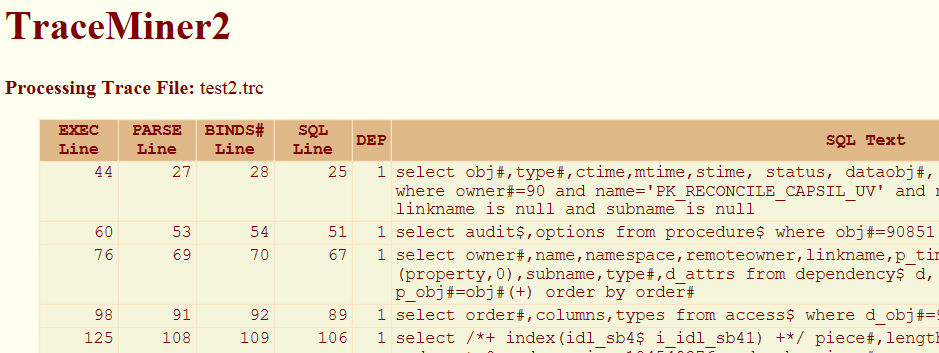

============================
Oracle Trace Files Explained
============================

..  Warning. Do not allow any column spans in any tables if you are producing
    PDF output as it messes up the table spacing. This applies to any spans and
    not just those in the final row, final column etc. Works for DOCX though.

Introduction
============

Oracle trace files are not greatly documented. This document is an attempt to do so. It is not official in any way and is based on a good few years of reading these files to help diagnose various database problems.

A trace file is really the best way to delve into what Oracle is doing, or to discover why something is taking so long - it shows you exactly what happened during the period that the session was being traced.

Even better, when you extract an Explain Plan from a trace file, it is showing you exactly how Oracle retrieved the data from the tables, and exactly where the time was spend in doing so. Running an ``Explain Plan for ...`` statement in SQL*Plus, Toad etc tells you what Oracle *might* do. The two are not always the same.

TraceAdjust
-----------

**Unashamed plug** 

*TraceAdjust* is a utility that I wrote to help me process the myriads of trace files that I come across in my DBA work. You can get the source code from github at
``https://github.com/NormanDunbar/TraceAdjust`` and compile it on Windows or Linux/Unix with any decent C++ compiler.

It reads a normal trace file and writes out an adjusted one, as follows:

-   The ``tim`` values are converted to seconds, by inserting a decimal point in the appropriate position;
-   It adds a ``delta`` to each ``tim`` line. The delta is the number of microseconds between the ``tim`` on this line, and the ``tim`` on the previous (appropriate) trace line. This al;lows me to see how long passed between the previous ``tim`` and this one. Occasionally useful!
-   It adds a ``dslt`` to each ``tim`` line. This is the "delta since last timestamp" and simply counts up the number of microseconds that have passed since the trace file last produced a timestamp line similar to the one in the header. Again, occasionally useful.
-   It adds a ``local`` to each ``tim`` line. This is a conversion of the ``tim`` value on the line, to an actual date, in the current local timezone. The time part is resolved down to microsecond level. This is usually very useful!

Running a trace file through TraceAdjust will create a new trace file, which some trace  analysing utilities cannot cope with due to the additional fields that I have introduced. The Trace File Browser, in Toad, on the other hand, copes with my trace files quite happily and simply ignores the additional data as appropriate.

Trace File Sections
===================

The trace file is made up of two main sections, the header and the trace details. 

The Header
----------

The header is the top of the file and consists of a few lines of text giving details of where the trace file came from, which server (operating System) it was created on, various details about the server and the database and so on.

The following is an example of a trace file created on a Windows server, running Oracle 11.2.0.4. Server, database and other potentially sensitive information has been obfuscated to protect the guilty, me!

..  code-block:: none

    Trace file C:\ORACLEDATABASE\diag\rdbms\cfg\cfg\trace\cfg_ora_27680_FREESPACE.trc
    Oracle Database 11g Enterprise Edition Release 11.2.0.4.0 - 64bit Production
    Windows NT Version V6.2  
    CPU                 : 8 - type 8664, 8 Physical Cores
    Process Affinity    : 0x0x0000000000000000
    Memory (Avail/Total): Ph:29917M/57343M, Ph+PgF:24634M/65535M 
    Instance name: orcl
    Redo thread mounted by this instance: 1
    Oracle process number: 373
    Windows thread id: 27680, image: ORACLE.EXE (SHAD)

    *** 2017-06-27 13:56:36.872
    *** SESSION ID:(1017.1085) 2017-06-27 13:56:36.872
    *** CLIENT ID:() 2017-06-27 13:56:36.872
    *** SERVICE NAME:(ORCLSRV) 2017-06-27 13:56:36.872
    *** MODULE NAME:(TOAD background query session) 2017-06-27 13:56:36.872
    *** ACTION NAME:() 2017-06-27 13:56:36.872
 
    =====================
    
The last line, consisting of equals signs, is the separator between the header and the following trace details.

Timestamp Lines
---------------

One line that you should be interested in is this one from the above:

..  code-block:: none

    *** 2017-06-27 13:56:36.872

This is the first timestamp line in the trace file and sets the baseline for all the ``tim`` fields (these will be explained below) that follow, however, briefly, the ``tim`` values are in microseconds (millionths of a second) from a specific "epoch" - which depends on the operating system - and there isn't a consistent, operating system independent, method of converting ``tim`` values from a huge number of microseconds to an actual date and time that humans will understand.

There are usually a few timestamp lines written to the trace file, depending on how long it has been processing for, and these mean that we can, with a bit of fiddling, relate a ``tim`` value to an actual time on the clock.

    
Trace Details
-------------

The majority of the trace file consists of the full trace details for the session that was traced. There are numerous lines of text here, each different, each with their own fields of one kind or another.

These are explained in the following sections.

    ====
    
    Remember, when Oracle writes a line to the trace file, it is done at the *end* of the process that was indicated by the written line. For example, if you see a ``FETCH`` line in the trace file, that was written at the tim (``tim``) that the ``FETCH`` completed. The trace file should be considered a list of things *that happened* and not *things that are about to happen*.
    
    ====

Recursive SQL
~~~~~~~~~~~~~

Your SQL statements are normally executed as top-level statements, but Oracle might need to execute some (a lot!) of recursive SQL statements, in order that your statement can be processed.

If, for example, you drop a user in a database with the ``drop user xxx cascade`` statement, Oracle goes off and executes hundreds of separate SQL statement to find out what objects the user owns, or has privileges to, and undoes all of those before finally dropping the contents of the user and finally the user itself.

Top-level SQL statements are identified by having a depth of zero. This can be seen in many of the trace file lines as ``dep=0`` in the various lines of the trace file.

Recursive statements, executed in the background, have a depth greater than zero, and some of these require recursive statements of their own, and so on.

This recursion leads to a foible in the trace file, your statement appears last and all the possibly nested, recursive statements will normally appear first. This is simply because in order for your statement to be executed, the recursive statements have to run to completion *first*.

For example, in a trace file I have open in front of me, the first statement with a ``dep=0`` occurs at line 709 in the file. Everything prior to that runs at ``dep=3``, ``dep=2`` or ``dep=1`` and complete before I can see my own SQl statement.

Under normal circumstances, a statement that is parsed (executed etc) at ``dep=n`` has been called recursively, to facilitate a statement, that will follow in the trace file, that is itself parsed (executed etc) at ``dep=n-1``.

Waits
~~~~~

``WAIT`` lines in a trace file are similar, in that the ``WAIT`` must complete, and so is written to the trace file *before* the statement that incurred the wait. For example, a ``FETCH`` that had to wait for ``db file scattered read`` events, will appear later in the trace file that the individual ``WAIT`` lines that the ``FETCH`` suffered from.

Cursor Ids
~~~~~~~~~~

Every time you see a '#' followed by a number, you are looking at a cursor ID. In previous versions of Oracle, these were simply an ever increasing number, starting from 1 and increasing by 1 for each new cursor.

In Oracle 11g, the cursor *appears* to be an address in memory[1]_, and *will be reused* as cursors are closed and new ones opened. You cannot assume, therefore, that a cursor with a specific ID at the end of the trace file, relates to any other lines with that same ID previously written to the trace file, without checking for any intervening ``CLOSE`` lines with the same ID - that's just how it is now!

Active or Inactive
~~~~~~~~~~~~~~~~~~

You might want to look in the  ``STATUS`` column in ``V$SESSION`` to determine if the session is active - doing *something* - or not. However, you must be aware that the ``STATUS`` column only gives an active reading when the statement is in a ``PARSE``, ``EXEC`` or ``FETCH`` phase of execution. If the statement is in a ``WAIT``, for example, it will show as inactive - but it is actually still processing  the current statement. Something to bear in mind.

Trace File Details
==================

PARSING IN CURSOR
-----------------

This is *usually* the first line you will see for a cursor. It shows the full SQL statement between the ``PARSING IN CURSOR`` line and the ``END OF STMT`` line. The SQL is displayed exactly as the user (or application) entered it. However, if the statement is invalid, or cannot be parsed, you will not see this, or the ``PARSE`` line in the trace file, you will only see a ``PARSE ERROR`` line instead.

This is not the actual ``PARSE`` for the cursor though, that normally follows on later, usually!

As an example, here is the ``PARSING IN CURSOR`` line for the SQL query that Toad runs in the background to extract the free space used in the database by various tablespaces, including temporary ones:

..  code-block:: none

    PARSING IN CURSOR #3220341128 len=3081 dep=0 uid=0 oct=3 lid=0 tim=3520788574727 hv=3219027813 ad='7ffcb6778350' sqlid='7bwtj5azxwxv5'

The various fields defined, and their descriptions can be seen in the table below.
    
+----------+-------------------------------------------------+
| Code     | Description                                     |
+==========+=================================================+
| #nnnn    | The cursor ID. This may be reused if for future |
|          | cursors if this one is closed, and another      |
|          | opened.                                         |
+----------+-------------------------------------------------+
| len      | The size, in bytes? Characters? of the SQL      |
|          | statement.                                      |
+----------+-------------------------------------------------+
| dep      | Recursion level. 0 = Top-level, user, SQL.      |
+----------+-------------------------------------------------+
| uid      | The user id of the user parsing the statement.  |
+----------+-------------------------------------------------+
| oct      | Oracle Command Code of the SQL Statement. (See  |
|          | Appendices.)                                    |
+----------+-------------------------------------------------+
| lid      | Unknown.                                        |
+----------+-------------------------------------------------+
| tim      | Time, in microseconds, for this statement to be |
|          | parsed. This is not the time it took!           |
+----------+-------------------------------------------------+
| hv       | Hash Value for the statement.                   |
+----------+-------------------------------------------------+
| ad       | Cursor address in memory?                       |
+----------+-------------------------------------------------+
| sqlid    | The SQL ID for the statement.                   |
+----------+-------------------------------------------------+

The ``uid`` field references the column ``USER_ID`` in the views ``DBA_USERS``, ``ALL_USERS`` and ``USER_USERS``.

The ``lid`` field is unknown at present. It's probably an ID of some kind, but for what?

As mentioned, the cursor ID field has a value that may (or may not) be an address in memory. However, that's not the same as the ``ad`` field, which is (I think) an address in memory for the cursor. 

The ``sqlid`` field is the same as the ``SQL_ID`` column in ``V$SQL``. The ``hv`` field is the hash value that Oracle used to determine if this statement was to be found in the cache or not. It matches the ``SQL_HASH_VALUE`` (and ``PREV_HASH_VALUE``) column in ``V$SESSION`` and also the ``HASH_VALUE`` column in ``V$SQL``.

Sometime Oracle will not write these lines to the trace file. If the cursor has been parsed, and subsequently coded, then re-parsed, you will see a ``PARSE`` line but not a new ``PARSING IN CURSOR`` for the statement. This *appears* to be only on those occasions where the statement is re-parsed *immediately* after being closed. I have not seen this "feature" when the cursor ID was used by a different statement in between.

PARSE
-----

Normally, after the ``PARSING IN CURSOR`` lines, you will see a ``PARSE`` line for the same cursor ID. This is not always the case, for example, if you started the trace after the statement had been parsed, Oracle will write the ``PARSING IN CURSOR`` lines, but not the ``PARSE``, to the trace file.

A typical ``PARSE`` line will look like this:

..  code-block:: none

    PARSE #491311368:c=0,e=452,p=0,cr=0,cu=0,mis=1,r=0,dep=0,og=1,plh=1388734953,tim=97734887542

+----------+-------------------------------------------------+
| Code     | Description                                     |
+==========+=================================================+
| #nnnn    | The cursor ID. This may be reused if for future |
|          | cursors if this one is closed, and another      |
|          | opened.                                         |
+----------+-------------------------------------------------+
| c        | Elapsed CPU time. Microseconds.                 |
+----------+-------------------------------------------------+
| e        | Elapsed wall clock time, also in microseconds.  |
+----------+-------------------------------------------------+
| p        | The number of physical reads (blocks) that were |
|          | necessary in order to carry out this ``PARSE``. |
+----------+-------------------------------------------------+
| cr       | The number of consistent reads (blocks) that    |
|          | were necessary in order to carry out this       |
|          | ``PARSE``.                                      |
+----------+-------------------------------------------------+
| cu       | The number of current reads (blocks) that were  |
|          | necessary in order to carry out this ``PARSE``. |
+----------+-------------------------------------------------+
| mis      | Whether this statement was found in the cache   |
|          | (0) or not (1). Indicates whether or not a hard |
|          | parse was required. Seeing a 1 is bad, usually. |
+----------+-------------------------------------------------+
| r        | Rows processed.                                 |
+----------+-------------------------------------------------+
| dep      | Recursion level. 0 = Top-level, user, SQL.      |
+----------+-------------------------------------------------+
| og       | Optimiser goal. 1 = ALL_ROWS, 2 = FIRST_ROWS,   |
|          | 3 = RULE, 4 = CHOOSE. Depending on your version |
|          | of Oracle, you may not see some of the above.   |
+----------+-------------------------------------------------+
| plh      | Execution plan hash value.                      |
+----------+-------------------------------------------------+
| tim      | Time, in microseconds, when the parse for the   |
|          | statement completed. **Not** the time it took.  |
+----------+-------------------------------------------------+

The ``plh`` value is a value that corresponds to the column ``PLAN_HASH_VALUE`` in ``V$SQL_PLAN``, ``V$SQL_PLAN_STATISTICS_ALL`` and ``V$SQLSTATS``. (There may be other views where this value appears, depending on the Oracle version in use.)

The ``p``, ``cr`` and ``cu`` statistics are the usual ones for block reads, viz:

-   Physical reads occur when Oracle must read a block, from disc, into the buffer cache. This indicates also an additional ``cr`` as the blcok will be used unchanged.
-   Consistent reads are the number of blocks of UNDO that Oracle applied to one or more blocks, in order to return the data in those blocks, to the state they were in when the "query" started. The query in this case, would be any or all recursive queries necessary to facilitate the ``PARSE``.
-   Current Reads are blocks that Oracle used without needing to roll them back to the start of the "query".

The fields for an ``PARSE`` are the same as those for an ``EXEC`` and a ``FETCH`` - see below.

The ``r`` field is *interesting*. Surely only a ``FETCH`` would process some rows? I thought so too, and in all the trace files I've come across, I have yet to see (ok, yet to *notice*) a ``PARSE`` line with anything other than ``r=0``. I wonder why Oracle have it as part of the ``PARSE``? Maybe, because they use the same format of line for the ``PARSE`` and ``EXEC`` they decided just to use the same one, and set the row count for a ``PARSE`` to zero?[2]_

PARSE ERROR
-----------

If a ``PARSE`` goes wrong for some reason, the trace file will show something like the following:

..  code-block:: none

    PARSE ERROR #491311368:len=26 dep=0 uid=755 oct=3 lid=755 tim=97734836031 err=1031
    SELECT LIVE_DEV FROM SITE

There will not normally be a ``PARSING IN CURSOR`` or a ``PARSE`` shown in the trace file for this statement.    
    
+----------+-------------------------------------------------+
| Code     | Description                                     |
+==========+=================================================+
| #nnnn    | The cursor ID. This may be reused if for future |
|          | cursors if this one is closed, and another      |
|          | opened.                                         |
+----------+-------------------------------------------------+
| len      | The length of the SQL statement in bytes, maybe |
|          | characters depending on your characterset.      |
+----------+-------------------------------------------------+
| dep      | Recursion level. 0 = Top-level, user, SQL.      |
+----------+-------------------------------------------------+
| uid      | The user id of the user parsing the statement.  |
+----------+-------------------------------------------------+
| oct      | Oracle Command Code of the SQL Statement. (See  |
|          | Appendices.)                                    |
+----------+-------------------------------------------------+
| lid      | Unknown.                                        |
+----------+-------------------------------------------------+
| tim      | Time, in microseconds, when this parse error    |
|          | was detected.                                   |
+----------+-------------------------------------------------+
| err      | The Oracle error code that caused the parse to  |
|          | fail.                                           |
+----------+-------------------------------------------------+

In this case, there was an error ``ORA-01031: insufficient privileges`` as the user parsing the statement did not have the required privileges to see the table in question. 

The ``uid`` field references the column ``USER_ID`` in the views ``DBA_USERS``, ``ALL_USERS`` and ``USER_USERS``.

EXEC
----

The ``EXEC`` phase of a statement's execution is when Oracle dives into the database to build a result set of the desired data. It need not be the complete result set though, so beware of that.

A typical ``EXEC`` will resemble the following:

..  code-block:: none

    EXEC #3220341128:c=0,e=101,p=0,cr=0,cu=0,mis=0,r=0,dep=0,og=1,plh=2215247290,tim=3520788606189

Bear in mind, however, that the ``EXEC`` elapsed times do not necessarily bear any resemblance to the entire time it took for the user to get a response. That response time includes the ``PARSE``, ``EXEC``, all the ``FETCH``es and all the ``WAIT``s that were encountered.

The fields in an ``EXEC`` are as follows:

+----------+-------------------------------------------------+
| Code     | Description                                     |
+==========+=================================================+
| #nnnn    | The cursor ID. This may be reused if for future |
|          | cursors if this one is closed, and another      |
|          | opened.                                         |
+----------+-------------------------------------------------+
| c        | Elapsed CPU time. Microseconds.                 |
+----------+-------------------------------------------------+
| e        | Elapsed wall clock time, also in microseconds.  |
+----------+-------------------------------------------------+
| p        | The number of physical reads (blocks) that were |
|          | necessary in order to carry out this ``PARSE``. |
+----------+-------------------------------------------------+
| cr       | The number of consistent reads (blocks) that    |
|          | were necessary in order to carry out this       |
|          | ``PARSE``.                                      |
+----------+-------------------------------------------------+
| cu       | The number of current reads (blocks) that were  |
|          | necessary in order to carry out this ``PARSE``. |
+----------+-------------------------------------------------+
| mis      | Whether this statement was found in the cache   |
|          | (0) or not (1). Indicates whether or not a hard |
|          | parse was required. Seeing a 1 is bad, usually. |
+----------+-------------------------------------------------+
| dep      | Recursion level. 0 = Top-level, user, SQL.      |
+----------+-------------------------------------------------+
| r        | Rows processed.                                 |
+----------+-------------------------------------------------+
| og       | Optimiser goal. 1 = ALL_ROWS, 2 = FIRST_ROWS,   |
|          | 3 = RULE, 4 = CHOOSE. Depending on your version |
|          | of Oracle, you may not see some of the above.   |
+----------+-------------------------------------------------+
| plh      | Execution plan hash value.                      |
+----------+-------------------------------------------------+
| tim      | Time, in microseconds, for this statement to be |
|          | executed. This is **not** the time it took!     |
+----------+-------------------------------------------------+

The fields for an ``EXEC`` are the same as those for a ``PARSE`` (and ``FETCH`` - see below). 

The ``r`` field is *interesting*. Surely only a ``FETCH`` would process some rows? Not necessarily. Normally, when ``EXEC``ing a statement, the number of rows processed is indeed zero, but some PL/SQL, for example, returns a row count of 1. In my demonstration trace file I see 4 statements whose ``EXEC`` has ``r=1`` and all of them are of the format:

..  code-block:: none

    begin
        do_something();
    end;
    
The "do_something()" call is to ``DBMS_MONITOR.START_TRACE``, ``DBMS_MONITOR.STOP_TRACE`` and calls to ``DBMS_OUTPUT.GET_LINE``. These statements have no ``FETCH`` calls.

You may wish to refer back to the details on the ``PARSE`` line, above, for details of the ``p``, ``cr`` and ``cu`` block statistics in the ``EXEC`` line.

FETCH
-----

After processing the ``EXEC`` call, and any associated ``WAIT``s, Oracle may ``FETCH`` some, or all, of the rows returned by the query. A ``FETCH`` line may resemble the following:

..  code-block::

    FETCH #3220341128:c=1812500,e=28665431,p=11137,cr=50774,cu=316,mis=0,r=30,dep=0,og=1,plh=2215247290,tim=3520817271640
    
And anyone paying close attention will notice that the time it took to ``FETCH`` 30 rows was a little excessive at 28.66 seconds! In case you are wondering, this is a query against ``DBA_FREE_SPACE`` on an 11.2.0.4 database, and it is taking so long as it is hitting the *never to be solved* `Bug 19125876 <https://support.oracle.com/epmos/faces/BugDisplay?_afrLoop=109163696075238&id=19125876&_afrWindowMode=0&_adf.ctrl-state=9eq93xdtt_165>`_ which affects 11.20.4 on AIX on Power Systems. Unfortunately, *this* trace file is from a Windows server. The bug was logged on 30th June 2014, last updated on 26th June 2017, *and is not yet fixed!* 

+----------+-------------------------------------------------+
| Code     | Description                                     |
+==========+=================================================+
| #nnnn    | The cursor ID. This may be reused if for future |
|          | cursors if this one is closed, and another      |
|          | opened.                                         |
+----------+-------------------------------------------------+
| c        | Elapsed CPU time. Microseconds.                 |
+----------+-------------------------------------------------+
| e        | Elapsed wall clock time, also in microseconds.  |
+----------+-------------------------------------------------+
| p        | The number of physical reads (blocks) that were |
|          | necessary in order to carry out this ``FETCH``. |
+----------+-------------------------------------------------+
| cr       | The number of consistent reads (blocks) that    |
|          | were necessary in order to carry out this       |
|          | ``FETCH``.                                      |
+----------+-------------------------------------------------+
| cu       | The number of current reads (blocks) that were  |
|          | necessary in order to carry out this ``FETCH``. |
+----------+-------------------------------------------------+
| mis      | Whether this statement was found in the cache   |
|          | (0) or not (1).                                 |
+----------+-------------------------------------------------+
| r        | Rows processed.                                 |
+----------+-------------------------------------------------+
| dep      | Recursion level. 0 = Top-level, user, SQL.      |
+----------+-------------------------------------------------+
| og       | Optimiser goal. 1 = ALL_ROWS, 2 = FIRST_ROWS,   |
|          | 3 = RULE, 4 = CHOOSE. Depending on your version |
|          | of Oracle, you may not see some of the above.   |
+----------+-------------------------------------------------+
| plh      | Execution plan hash value.                      |
+----------+-------------------------------------------------+
| tim      | Time, in microseconds, that this one fetch was  |
|          | completed.                                      |
+----------+-------------------------------------------------+

The fields for a ``FETCH`` are also the same as those for a ``PARSE`` and ``EXEC``. 

The ``mis`` field is *interesting*. Surely only a ``PARSE`` would indicate a miss in the cache? Again, I think Oracle are using the same format of a trace line for ``PARSE``, ``EXEC`` and ``FETCH`` and simply ignoring or defaulting certain, non-applicable, fields.

You may wish to refer back to the details on the ``PARSE`` line, above, for details of the ``p``, ``cr`` and ``cu`` block statistics in the ``EXEC`` line.

WAIT
----

This is the meat of the trace file, usually. Under normal circumstances, it's usual for the various phases of execution (``PARSE``, ``EXEC`` and ``FETCH``) to encounter some ``WAIT`` events. And I would say, personally[3]_\ , that these ``WAIT`` states are where the vast majority of the total response time is encountered. 

A ``WAIT`` line in the trace file will resemble the following example, up until Oracle 9i at the latest:

..  code-block:: none

    WAIT #3220341128: nam='db file sequential read' ela= 2769 p1=37 p2=12931 p3=1

+----------+-------------------------------------------------+
| Code     | Description                                     |
+==========+=================================================+
| #nnnn    | The cursor ID. This may be reused if for future |
|          | cursors if this one is closed, and another      |
|          | opened.                                         |
+----------+-------------------------------------------------+
| nam      | The name of the wait event encountered.         |
+----------+-------------------------------------------------+
| ela      | Elapsed wall clock time, in microseconds.       |
+----------+-------------------------------------------------+
| p1       | Event parameter 1.                              |
+----------+-------------------------------------------------+
| p2       | Event parameter 2.                              |
+----------+-------------------------------------------------+
| p3       | Event parameter 3.                              |
+----------+-------------------------------------------------+

The ``p1``, ``p2`` and ``p3`` parameters are different depending on the wait event name. You may require to loom them up in ``V$EVENT_NAME`` to understand what they refer to. For the event above, we see the following:

-   p1 is the file number;
-   p2 is the (starting) block number;
-   p3 is the number of blocks requested.

You may wish to use the following query to determine the various parameters for the ``WAIT`` events seen in the trace file:

..  code-block:: sql

    select name, parameter1, parameter2, parameter3
    from v$event_name
    where name = 'db file sequential read';

Substitute the appropriate event name for your particular ``WAIT`` event of course. And, don't forget, it *is* case sensitive - Oracle are seriously inconsistent when it comes to naming events!

In Oracle versions 10g onwards, the format is much easier to understand as the generic ``p1``, ``p2`` and ``p3`` have been replaced by something more meaningful, as follows for the same ``WAIT`` event:

..  code-block:: none

    WAIT #3220341128: nam='db file sequential read' ela= 1023 file#=3 block#=12 blocks=1 obj#=-1 tim=3520817183625

+----------+-------------------------------------------------+
| Code     | Description                                     |
+==========+=================================================+
| #nnnn    | The cursor ID. This may be reused if for future |
|          | cursors if this one is closed, and another      |
|          | opened.                                         |
+----------+-------------------------------------------------+
| nam      | The name of the wait event encountered.         |
+----------+-------------------------------------------------+
| ela      | Elapsed wall clock time, in microseconds.       |
+----------+-------------------------------------------------+
| file#    | For this wait, the file number.                 |
+----------+-------------------------------------------------+
| block#   | For this wait, the (starting) block number.     |
+----------+-------------------------------------------------+
| blocks   | For this wait, the number of blocks requested.  |
+----------+-------------------------------------------------+
| obj#     | If appropriate, the object in question.         |
+----------+-------------------------------------------------+
| tim      | Time, in microseconds, that this one wait was   |
|          | completed.                                      |
+----------+-------------------------------------------------+

    ====
    
    The above is an example of one particular ``WAIT`` event. Other events will have different parameters, as appropriate for the particular event. At least, from 10g onwards, we don't have to look up ``V$WAIT_NAME`` every time we find a new event in our trace file! Oracle 11g added it's own fields too.
    
    ====

The ``obj#`` refers to a specific object, where one is involved. In the above example, the value is -1, so there is no particular object in this ``WAIT``. We are waiting for a block off of the disc, which *may* be part of an index or a table, etc, but for the sake of this ``WAIT``, Oracle considers that there is not a specific object involved.

Where an ``obj#`` is not -1, then the value refers to the ``OBJECT_ID`` in the ``DBA_OBJECTS`` view.

ERROR
-----
If an error is detected while tracing a session, the trace file may show something like the following:

..  code-block:: none

    ERROR #275452960:err=31013 tim=1075688943194
    
+----------+-------------------------------------------------+
| Code     | Description                                     |
+==========+=================================================+
| #nnnn    | The cursor ID. This may be reused if for future |
|          | cursors if this one is closed, and another      |
|          | opened.                                         |
+----------+-------------------------------------------------+
| err      | The Oracle error code that caused the error.    |
+----------+-------------------------------------------------+
| tim      | Time, in microseconds, when this error was      |
|          | detected.                                       |
+----------+-------------------------------------------------+

In this example, the error relates to ``ORA-31013: Invalid XPATH expression`` and indeed, is what the user saw on their terminal at the time - and was the reason I traced it because the application wasn't good enough in explaining which object caused the problem!

STAT
----

In order to see the ``STAT`` lines in your trace file, the ``TIMED_STATISTICS`` parameter for the database must be set to ``TRUE``.

In Oracle 9i, there are no execution statistics or timings displayed in the ``op`` field. These are only present from 10g onwards.

The ``STAT`` lines show you *exactly* how Oracle went about getting the data back to you. It is possible for this to be different for the plan displayed by the ``EXPLAIN PLAN FOR ...`` statement. IN a trace file, it shows what happened, as opposed to what *might* happen!

A typical ``STAT`` output could resemble the following:

..  code-block:: none

    STAT #5141189408 id=1 cnt=1 pid=0 pos=1 obj=20 op='TABLE ACCESS BY INDEX ROWID ICOL$ (cr=4 pr=0 pw=0 time=26 us cost=2 size=54 card=2)'
    STAT #5141189408 id=2 cnt=1 pid=1 pos=1 obj=42 op='INDEX RANGE SCAN I_ICOL1 (cr=3 pr=0 pw=0 time=22 us cost=1 size=0 card=2)'

+----------+-------------------------------------------------+
| Code     | Description                                     |
+==========+=================================================+
| #nnnn    | The cursor ID. This may be reused if for future |
|          | cursors if this one is closed, and another      |
|          | opened.                                         |
+----------+-------------------------------------------------+
| id       | The identifier for this row of the explain plan |
|          | may be referred to by the ``pid`` field, in     |
|          | nested ``STAT`` lines. Allows a hierarchy to be |
|          | built.                                          |
+----------+-------------------------------------------------+
| cnt      | The number of rows processed by this step in    |
|          | explain plan.                                   |
+----------+-------------------------------------------------+
| pid      | The parent ID for this step on the plan. Should |
|          | be zero on the ``id=1`` line.                   |
+----------+-------------------------------------------------+
| pos      | The position of this step, within the parent    |
|          | steps in the plan.                              |
+----------+-------------------------------------------------+
| obj      | The object identifier.                          |
+----------+-------------------------------------------------+
| op       | The operation performed by this step. This will |
|          | include additional statistical and timing       |
|          | figures from 10g onwards. 9i is sadly deficient |
|          | in this matter!                                 |
+----------+-------------------------------------------------+

Although the example ``STAT`` lines above show only a couple of lines, it is possible for more than one to be present under a single parent step. In this case, the ``pid`` would be the same, but the ``pos`` would be different. 

    ====
    
    ``Pos`` *should* be a sequentiality increasing number, showing which step was executed when in order to facilitate the parent step, however, I have seen trace files where there have been more than one row with the same ``pid`` *and* the same ``pos``. This is *a bad thing* when trying to figure out what happened when!

    ====

In 10g and above, the additional fields in the ``op`` field itself, are as follows:

+----------+-------------------------------------------------+
| Code     | Description                                     |
+==========+=================================================+
| cr       | The number of consistent reads.                 |
+----------+-------------------------------------------------+
| pr       | The number of physical reads.                   |
+----------+-------------------------------------------------+
| pw       | The number of physical writes.                  |
+----------+-------------------------------------------------+
| time     | The elapsed time in microseconds.               |
+----------+-------------------------------------------------+
| cost     | The cost of this step, as determined by the     |
|          | Cost Based Optimiser.                           |
+----------+-------------------------------------------------+
| size     | Form 11g, an estimate of the size, in bytes, of |
|          | the data returned by this step.                 |
+----------+-------------------------------------------------+
| card     | The number of rows processed. 11g onwards.      |
+----------+-------------------------------------------------+

    
CLOSE
-----

An example of a ``CLOSE`` line from a trace file is as follows:

..  code-block:: none

    CLOSE #3220452784:c=0,e=13,dep=0,type=0,tim=3520822918452

+----------+-------------------------------------------------+
| Code     | Description                                     |
+==========+=================================================+
| #nnnn    | The cursor ID. This may be reused if for future |
|          | cursors if this one is closed, and another      |
|          | opened.                                         |
+----------+-------------------------------------------------+
| c        | Elapsed CPU time. Microseconds.                 |
+----------+-------------------------------------------------+
| e        | Elapsed wall clock time, also in microseconds.  |
+----------+-------------------------------------------------+
| dep      | Recursion level. 0 = Top-level, user, SQL.      |
+----------+-------------------------------------------------+
| type     | Close type.                                     |
+----------+-------------------------------------------------+
| tim      | Time, in microseconds, that this statement was  |
|          | closed. This is the time it was actually closed |
|          | **not** when the close started.                 |
+----------+-------------------------------------------------+

This line is written when a cursor used for an SQL statement, is no longer required and has been closed. The elapsed times relate to the time it took to close the cursor.

The ``type`` field is used to determine how the cursor was closed. It takes the following values:

-   0 if the cursor was hard closed. This indicates that the cursor was not saved in the server side closed cursor cache for later reuse. This can be because:

    -   The statement is a DDL statement. DDL statements are never cached.
    -   ``SESSION_CACHED_CURSORS`` is set to zero, and no caching is permitted.
    -   The statement could be cached, but as it has not been executed often enough (three times minimum), then it has not yet been cached.
    
-   1 if the cursor has been cached, as opposed to properly closed, in an empty slot in the cache.
-   2 if the cursor was cached, but caused another cursor to be aged out as there were no free slots.
-   3 if the cursor remains in the cache.

currently unknown, but I have seen two values here zero and 3. So far I have not been able to determine what this means as the values relate to PL/SQL and SQL cursors, those opened with the rule based optimiser and those with the cost based one. Nothing seems to match up.

A cursor ID that has been closed may be re-used by a subsequent opening of a new cursor, which can be for a different statement, or for this one again.

XCTEND
------

This line in a trace file indicates the end of a transaction. Sometimes you will see this:

..  code-block:: none

    PARSING IN CURSOR #398131288 len=6 dep=1 uid=90 oct=44 lid=90 tim=1484913807072 hv=255718823 ad='0' sqlid='8ggw94h7mvxd7'
    COMMIT
    END OF STMT
    PARSE #398131288:c=0,e=4,p=0,cr=0,cu=0,mis=0,r=0,dep=1,og=0,plh=0,tim=1484913807071
    XCTEND rlbk=0, rd_only=1, tim=1484913807100
    EXEC #398131288:c=0,e=27,p=0,cr=0,cu=0,mis=0,r=0,dep=1,og=0,plh=0,tim=1484913807121
    CLOSE #398131288:c=0,e=0,dep=1,type=3,tim=1484913807132

You can see here the entire ``PARSE``, ``EXEC`` and ``CLOSE`` for the statement. Sometimes, you don't see the ``COMMIT`` (or ``ROLLBACK``) statement being parsed, all you see is the ``XCTEND`` line in the trace file. Why? I have no idea - it's an Oracle thing!

You should notice in the above, that the transaction was completed *before* the ``EXEC`` completed. remember that the trace file shows things after they have finished. So the ``EXEC`` of the ``COMMIT`` statement had to wait for the transaction to end before it could complete.

The fields you will see in an ``XCTEND`` line are as follows:
    
+----------+-------------------------------------------------+
| Code     | Description                                     |
+==========+=================================================+
| rlbk     | 0 indicates ``COMMIT``, 1 is for ``ROLLBACK``.  |
+----------+-------------------------------------------------+
| rd_only  | Whether or not the transaction was read only (1)|
|          | or read write (0) regardless of ``COMMIT`` or   |
|          | ``ROLLBACK`` being executed to end it.          |
+----------+-------------------------------------------------+
| tim      | Time, in microseconds, at which the transaction |
|          | ended.                                          |
+----------+-------------------------------------------------+

BINDS
-----

To see the bind details in a trace file, you need to have enabled at least trace level 4 (for a 10046 event), or set ``binds => true`` for ``DBMS_SUPPORT`` and ``DBMS_MONITOR`` calls to start tracing. You should also be *using* binds in your SQL statement too of course!

There is a *lot* of information in the binds section of a trace file. For 9i, the following data are listed:

+----------+-------------------------------------------------+
| Code     | Description                                     |
+==========+=================================================+
| dty      | Data type code. (See Appendices.)               |
+----------+-------------------------------------------------+
| mxl      | Maximum length of the bind variable value.      |
|          | (private maximum length in parentheses.)        |
+----------+-------------------------------------------------+
| mal      | Array length.                                   |
+----------+-------------------------------------------------+
| scl      | Scale. Only for numeric binds.                  |
+----------+-------------------------------------------------+
| pre      | Precision. Only for numeric binds.              |
+----------+-------------------------------------------------+
| oacflg   | Special flag indicating bind options.           |
+----------+-------------------------------------------------+
| oacflg2  | Second part of oacflg.                          |
+----------+-------------------------------------------------+
| size     | Amount of memory to be allocated for this chunk |
|          | of the bind.                                    |
+----------+-------------------------------------------------+
| offset   | Offset into this chunk for this bind buffer.    |
+----------+-------------------------------------------------+
| bfp      | Bind address.                                   |
+----------+-------------------------------------------------+
| bln      | Bind buffer length.                             |
+----------+-------------------------------------------------+
| avl      | Actual value length. A value of zero = NULL, or |
|          | a PL/SQL OUT bind - if the cursor's command is  |
|          | 47 for PL/SQL Execution.                        |
+----------+-------------------------------------------------+
| flg      | Bind status flag.                               |
+----------+-------------------------------------------------+
| value    | Value of the bind variable.                     |
+----------+-------------------------------------------------+

While for 10g upwards, we would expect to see the following:

+----------+-------------------------------------------------+
| Code     | Description                                     |
+==========+=================================================+
| oacdty   | Data type code.  (See Appendices.)              |
+----------+-------------------------------------------------+
| mxl      | Maximum length, in bytes, of the bind variable  |
|          | value. (Used length in parentheses.)            |
+----------+-------------------------------------------------+
| mxlc     | Maximum length, in characters, of the bind      |
|          | variable value. (Used length in parentheses.)   |
+----------+-------------------------------------------------+
| mal      | Array length.                                   |
+----------+-------------------------------------------------+
| scl      | Scale. Only for numeric binds.                  |
+----------+-------------------------------------------------+
| pre      | Precision. Only for numeric binds.              |
+----------+-------------------------------------------------+
| oacflg   | Special flag indicating bind options.           |
+----------+-------------------------------------------------+
| fl2      | Second part of oacflg.                          |
+----------+-------------------------------------------------+
| frm      | Unknown.                                        |
+----------+-------------------------------------------------+
| csi      | Identifier code for the database's default or   |
|          | national character set. (See Appendices.)       |
|          | Only used in character/string binds.            |
+----------+-------------------------------------------------+
| siz      | Size of memory to be allocated for this chunk.  |
+----------+-------------------------------------------------+
| off      | Offset into the chunk of the bind buffer.       |
+----------+-------------------------------------------------+
| kxsbbbfp | Bind address.                                   |
+----------+-------------------------------------------------+
| bln      | Bind buffer length.                             |
+----------+-------------------------------------------------+
| avl      | Actual value length. A value of zero = NULL, or |
|          | a PL/SQL OUT bind - if the cursor's command is  |
|          | 47 for PL/SQL Execution.                        |
+----------+-------------------------------------------------+
| flg      | Bind status flag.                               |
+----------+-------------------------------------------------+
| value    | Value of the bind variable, or a memory dump.   |
|          | This field will only be shown for any bind that |
|          | has a non-NULL value.                           |
+----------+-------------------------------------------------+

Binds always number from left to right in an SQL statement. This means that the first bind found in the statement, will be listed in the trace file as ``BIND#0`` regardless of its actual name or number in the statement.

If a bind, for example ``:3``, is used more than once in the *same* SQL statement, then it will appear *once* in the binds list - as ``BIND#2``, however, the statement itself will refer to it correctly as ``:3`` each time it is used.

The ``oacdty`` values are listed in the appendices for reference. There are quite a few of these, and you should note that experience has shown that the Oracle documentation doesn't always seem match up to the reality of a trace file. 

Always be aware, however, that just because a bind is defined to be a VARCHAR2, ``oacdty=01``, for example, it doesn't mean that the column in the table it relates to is also a VARCHAR2. Some people write code that passed VARCHAR2 values to a DATE column - this negating the ability to ever use an index (unless a function based index is created) on that DATE column!

The ``mxl`` fields shows how big the buffer assigned to this bind variable is, and how much of it has been used. This is measured in bytes. The ``mxlc`` shows, where applicable, the buffer size and used size in characters[4]_. This will depend on the character set in use. If the character size is not appropriate, then ``mxlc`` will be zero.

Examples
~~~~~~~~

The following is an 11g example of the binds section for the following (recursive) SQL statement:

..  code-block:: sql

    select o.owner#, o.name, o.namespace, o.obj#, d.d_timestamp, 
           nvl(d.property,0), o.type#, o.subname, d.d_attrs  
    from dependency$ d, obj$ o 
    where d.p_obj#=:1 
    and (d.p_timestamp=nvl(:2,d.p_timestamp) or d.property=2) 
    and o.owner#=nvl(:3,o.owner#) 
    and d.d_obj#=o.obj# 
    order by o.obj#

The binds section, extracted from the trace file, looks as follows:
    
..  code-block:: none

    BINDS #741210192:
     Bind#0
      oacdty=02 mxl=22(22) mxlc=00 mal=00 scl=00 pre=00
      oacflg=00 fl2=0001 frm=00 csi=00 siz=56 off=0
      kxsbbbfp=2c2d4c58  bln=22  avl=04  flg=05
      value=104305
     Bind#1
      oacdty=12 mxl=07(07) mxlc=00 mal=00 scl=00 pre=00
      oacflg=11 fl2=0001 frm=00 csi=00 siz=0 off=24
      kxsbbbfp=2c2d4c70  bln=07  avl=07  flg=01
      value="6/26/2017 9:58:26"
     Bind#2
      oacdty=02 mxl=22(22) mxlc=00 mal=00 scl=00 pre=00
      oacflg=01 fl2=0001 frm=00 csi=00 siz=0 off=32
      kxsbbbfp=2c2d4c78  bln=22  avl=00  flg=01

Looking specifically at the above, we can see the following:

-   We have two ``NUMBER`` binds, and one ``DATE``;
-   Neither of the ``NUMBER``s have a scale or precision;
-   The last bind, ``BIND#2``, is a ``NUMBER`` and is ``NULL`` (``avl=00``) and so has no value clause;
-   Because these binds are of specific types, where the storage is always exactly as indicated by the ``mxl`` field, the private storage used for the value is always the same length. In other words, ``NUMBER`` data types are always 22 bytes while ``DATE``s are 7;
-   There are no character sets applicable to ``NUMBER`` or ``DATE`` data types (``csi=00``).

Character (VARCHAR2, CHAR etc) binds take the following form:

..  code-block:: none

    Bind#1
     oacdty=01 mxl=32(04) mxlc=00 mal=00 scl=00 pre=00
     oacflg=10 fl2=0001 frm=01 csi=31 siz=0 off=24
     kxsbbbfp=610cd550 bln=32 avl=04 flg=01
     value="DUAL"

Here we can see that:

-   ``csi=31`` is listed so checking with the character set list, in the appendices of this document, we see that this means that the bind is using the ``WE8ISO8859P1`` character set;
-   The ``value`` can be easily read form the trace file. Had this been in a different character set, ``ALUTF16`` for example (``csi=2000``), then the value would most likely have been dumped in hexadecimal, as follows:

    ..  code-block:: none

        ...
        value = 0 44 0 55 0 41 0 4c

-   We can also see that although the maximum size of the buffer for this bind is 32, (``mxl=32``), only 4 bytes are in use (``mxl=32(04)``).

A ``REF_CURSOR`` bind, will resemble the following. It has an ``oacdty`` of 102, which appears to confuse the ``value`` field a little, as it implies that it cannot handle a data type of 102. Hmmm.

..  code-block:: none

    Bind#3
     oacdty=102 mxl=04(04) mxlc=00 mal=00 scl=00 pre=00
     oacflg=01 fl2=1000000 frm=00 csi=00 siz=0 off=176
     kxsbbbfp=c2a91548 bln=04 avl=04 flg=01
     value=Unhandled datatype (102) found in kxsbndinf
     Dump of memory from 0x00000000C2A91548 to 0x00000000C2A9154C
     0C2A91540 00000000 [....]

Another Unashamed Plug!
~~~~~~~~~~~~~~~~~~~~~~~

So, you have a trace file, chock full of statements with lots of bind variables in use. You need to read through it to find out which execution of the statement(s) used which actually bind values. How is this easily done?

*TraceMiner2*[5]_ is another utility that I wrote to help me process the myriads of trace files that I come across in my DBA work. You can get the source code from github at
``https://github.com/NormanDunbar/TraceMiner2`` and compile it on Windows or Linux/Unix with any decent C++ compiler.

It reads a trace file and writes out an HTML report showing various details of the SQL in the file, showing:

-   The line that the SQL statement was found at (``PARSING IN CURSOR``);
-   The line that the ``PARSE`` statement was found at;
-   The line that the ``BINDS`` details were found at;
-   The line that the ``EXEC`` statement was found at;
-   The ``dep`` of the statement when parsed etc.

You can choose to ignore statements at any given depth, so if you only want top-level statements, just request ``--depth=0`` on the command line. By default, the HTML report appears as follows:

  
However, you can, if you have a standard report format at your company, configure the generated css file  to match that of your format. *TraceMiner2* will not overwrite the css file if one exists in the output folder.

UNMAP
-----

Not often seen any more. It was used when a disc based sort, currently running, was interrupted by the user typing CTRL-C.

``UNMAP`` trace lines, if you ever see one, are identical to those of ``PARSE``, ``XEC`` and ``FETCH`` as described above. They are, apparently, related to cleaning up the sort segments whose details can be seen in ``V$SORT_USAGE``. I have not seen an ``UNMAP`` line in any trace file for many years, although I do remember trying to figure them out back in my 8i (or possibly 9i) days!

==========
Appendices
==========

Oracle Data Types
=================

The ``oacdty`` parameter in a bind variables details determines the data type of that bind variable. This is not necessarily the data type of the column in a table that it may be being ``INSERT``ed or ``UPDATE``d into, or compared against.

The following data are taken from the *Internal Data Types* section of the *Data Types* chapter in the 12cR2 *Oracle Call Interface* manual, which you can find at `<http://docs.oracle.com/database/122/LNOCI/data-types.htm#LNOCI16266>`_.

Listed data types are:

+------+--------------------------------+
| Code | Data Type                      |
+======+================================+
| 1    | VARCHAR2 or NVARCHAR2          |
+------+--------------------------------+
| 2    | NUMBER                         |
+------+--------------------------------+
| 8    | LONG                           |
+------+--------------------------------+
| 11   | ROWID[22]_                     |
+------+--------------------------------+
| 12   | DATE                           |
+------+--------------------------------+
| 23   | RAW                            |
+------+--------------------------------+
| 24   | LONG RAW                       |
+------+--------------------------------+
| 25   | Unhandled data type            |
+------+--------------------------------+
| 29   | Unhandled data type            |
+------+--------------------------------+
| 69   | ROWID                          |
+------+--------------------------------+
| 96   | CHAR or NCHAR                  |
+------+--------------------------------+
| 100  | BINARY_FLOAT                   |
+------+--------------------------------+
| 101  | BINARY_DOUBLE                  |
+------+--------------------------------+
| 102  | REF_CURSOR[23]_                |
+------+--------------------------------+
| 108  | User-defined type -            |
|      | object type, VARRAY,           |
|      | nested table)                  |
+------+--------------------------------+
| 111  | REF                            |
+------+--------------------------------+
| 112  | CLOB or NCLOB                  |
+------+--------------------------------+
| 113  | BLOB                           |
+------+--------------------------------+
| 114  | BFILE                          |
+------+--------------------------------+
| 123  | VARRAY[24]_                    |
+------+--------------------------------+
| 180  | TIMESTAMP                      |
+------+--------------------------------+
| 181  | TIMESTAMP WITH TIME ZONE       |
+------+--------------------------------+
| 182  | INTERVAL YEAR TO MONTH         |
+------+--------------------------------+
| 183  | INTERVAL DAY TO SECOND         |
+------+--------------------------------+
| 208  | UROWID                         |
+------+--------------------------------+
| 231  | TIMESTAMP WITH LOCAL TIME ZONE |
+------+--------------------------------+

However, various other sources on the internet, and in books, seem to disagree with some of what the above table shows. In addition, I have come across at least one Oracle Trace where a ROWID was code 11 and not code 69, also, I have seen VARRAY as code 123 and not as code 108. Consistency? Who mentioned consistency?

Oracle Command Codes
====================

The ``oct`` parameter in a PARSING IN CURSOR line in an Oracle trace file, determines the command that is being parsed in the SQL statement.

Known command types are:

+------+-----------------+
| Code | Data Type       |
+======+=================+
| 2    | INSERT          |
+------+-----------------+
| 3    | SELECT          |
+------+-----------------+
| 6    | UPDATE          |
+------+-----------------+
| 7    | DELETE          |
+------+-----------------+
| 26   | LOCK TABLE      |
+------+-----------------+
| 44   | COMMIT          |
+------+-----------------+
| 45   | ROLLBACK        |
+------+-----------------+
| 46   | SAVEPOINT       |
+------+-----------------+
| 47   | PL/SQL Block    |
+------+-----------------+
| 48   | SET TRANSACTION |
+------+-----------------+
| 55   | SET ROLE        |
+------+-----------------+
| 90   | SET CONSTRAINTS |
+------+-----------------+
| 170  | CALL            |
+------+-----------------+
| 189  | MERGE           |
+------+-----------------+

The following two tables outline the various command codes and are taken from an Oracle 12.1.0.2 database.

The first table shows codes 0 through 169, ``Unknown`` to ``Disassociate Statistics``:

+------+-----------------------+------+------------------------------+------+-----------------------------+
| Code | Command               | Code | Command                      | Code | Command                     |
+======+=======================+======+==============================+======+=============================+
| 0    | UNKNOWN               | 53   | DROP USER                    | 111  | DROP PUBLIC SYNONYM         |
+------+-----------------------+------+------------------------------+------+-----------------------------+
| 1    | CREATE TABLE          | 54   | DROP ROLE                    | 112  | CREATE PUBLIC DATABASE LINK |
+------+-----------------------+------+------------------------------+------+-----------------------------+
| 2    | INSERT                | 55   | SET ROLE                     | 113  | DROP PUBLIC DATABASE LINK   |
+------+-----------------------+------+------------------------------+------+-----------------------------+
| 3    | SELECT                | 56   | CREATE SCHEMA                | 114  | GRANT ROLE                  |
+------+-----------------------+------+------------------------------+------+-----------------------------+
| 4    | CREATE CLUSTER        | 57   | CREATE CONTROL FILE          | 115  | REVOKE ROLE                 |
+------+-----------------------+------+------------------------------+------+-----------------------------+
| 5    | ALTER CLUSTER         | 59   | CREATE TRIGGER               | 116  | EXECUTE PROCEDURE           |
+------+-----------------------+------+------------------------------+------+-----------------------------+
| 6    | UPDATE                | 60   | ALTER TRIGGER                | 117  | USER COMMENT                |
+------+-----------------------+------+------------------------------+------+-----------------------------+
| 7    | DELETE                | 61   | DROP TRIGGER                 | 118  | ENABLE TRIGGER              |
+------+-----------------------+------+------------------------------+------+-----------------------------+
| 8    | DROP CLUSTER          | 62   | ANALYZE TABLE                | 119  | DISABLE TRIGGER             |
+------+-----------------------+------+------------------------------+------+-----------------------------+
| 9    | CREATE INDEX          | 63   | ANALYZE INDEX                | 120  | ENABLE ALL TRIGGERS         |
+------+-----------------------+------+------------------------------+------+-----------------------------+
| 10   | DROP INDEX            | 64   | ANALYZE CLUSTER              | 121  | DISABLE ALL TRIGGERS        |
+------+-----------------------+------+------------------------------+------+-----------------------------+
| 11   | ALTER INDEX           | 65   | CREATE PROFILE               | 122  | NETWORK ERROR               |
+------+-----------------------+------+------------------------------+------+-----------------------------+
| 12   | DROP TABLE            | 66   | DROP PROFILE                 | 123  | EXECUTE TYPE                |
+------+-----------------------+------+------------------------------+------+-----------------------------+
| 13   | CREATE SEQUENCE       | 67   | ALTER PROFILE                | 128  | FLASHBACK                   |
+------+-----------------------+------+------------------------------+------+-----------------------------+
| 14   | ALTER SEQUENCE        | 68   | DROP PROCEDURE               | 129  | CREATE SESSION              |
+------+-----------------------+------+------------------------------+------+-----------------------------+
| 15   | ALTER TABLE           | 70   | ALTER RESOURCE COST          | 130  | ALTER MINING MODEL          |
+------+-----------------------+------+------------------------------+------+-----------------------------+
| 16   | DROP SEQUENCE         | 71   | CREATE MATERIALIZED VIEW LOG | 131  | SELECT MINING MODEL         |
+------+-----------------------+------+------------------------------+------+-----------------------------+
| 17   | GRANT OBJECT          | 72   | ALTER MATERIALIZED VIEW LOG  | 133  | CREATE MINING MODEL         |
+------+-----------------------+------+------------------------------+------+-----------------------------+
| 18   | REVOKE OBJECT         | 73   | DROP MATERIALIZED VIEW LOG   | 134  | ALTER PUBLIC SYNONYM        |
+------+-----------------------+------+------------------------------+------+-----------------------------+
| 19   | CREATE SYNONYM        | 74   | CREATE MATERIALIZED VIEW     | 135  | DIRECTORY EXECUTE           |
+------+-----------------------+------+------------------------------+------+-----------------------------+
| 20   | DROP SYNONYM          | 75   | ALTER MATERIALIZED VIEW      | 136  | SQL*LOADER DIRECT PATH LOAD |
+------+-----------------------+------+------------------------------+------+-----------------------------+
| 21   | CREATE VIEW           | 76   | DROP MATERIALIZED VIEW       | 137  | DATAPUMP DIRECT PATH UNLOAD |
+------+-----------------------+------+------------------------------+------+-----------------------------+
| 22   | DROP VIEW             | 77   | CREATE TYPE                  | 138  | DATABASE STARTUP            |
+------+-----------------------+------+------------------------------+------+-----------------------------+
| 23   | VALIDATE INDEX        | 78   | DROP TYPE                    | 139  | DATABASE SHUTDOWN           |
+------+-----------------------+------+------------------------------+------+-----------------------------+
| 24   | CREATE PROCEDURE      | 79   | ALTER ROLE                   | 140  | CREATE SQL TXLN PROFILE     |
+------+-----------------------+------+------------------------------+------+-----------------------------+
| 25   | ALTER PROCEDURE       | 80   | ALTER TYPE                   | 141  | ALTER SQL TXLN PROFILE      | 
+------+-----------------------+------+------------------------------+------+-----------------------------+
| 26   | LOCK                  | 81   | CREATE TYPE BODY             | 142  | USE SQL TXLN PROFILE        | 
+------+-----------------------+------+------------------------------+------+-----------------------------+
| 27   | NO-OP                 | 82   | ALTER TYPE BODY              | 143  | DROP SQL TXLN PROFILE       |
+------+-----------------------+------+------------------------------+------+-----------------------------+
| 28   | RENAME                | 83   | DROP TYPE BODY               | 144  | CREATE MEASURE FOLDER       |
+------+-----------------------+------+------------------------------+------+-----------------------------+
| 29   | COMMENT               | 84   | DROP LIBRARY                 | 145  | ALTER MEASURE FOLDER        |
+------+-----------------------+------+------------------------------+------+-----------------------------+
| 30   | AUDIT OBJECT          | 85   | TRUNCATE TABLE               | 146  | DROP MEASURE FOLDER         |
+------+-----------------------+------+------------------------------+------+-----------------------------+
| 31   | NOAUDIT OBJECT        | 86   | TRUNCATE CLUSTER             | 147  | CREATE CUBE BUILD PROCESS   |
+------+-----------------------+------+------------------------------+------+-----------------------------+
| 32   | CREATE DATABASE LINK  | 88   | ALTER VIEW                   | 148  | ALTER CUBE BUILD PROCESS    |
+------+-----------------------+------+------------------------------+------+-----------------------------+
| 33   | DROP DATABASE LINK    | 91   | CREATE FUNCTION              | 149  | DROP CUBE BUILD PROCESS     |
+------+-----------------------+------+------------------------------+------+-----------------------------+
| 34   | CREATE DATABASE       | 92   | ALTER FUNCTION               | 150  | CREATE CUBE                 |
+------+-----------------------+------+------------------------------+------+-----------------------------+
| 35   | ALTER DATABASE        | 93   | DROP FUNCTION                | 151  | ALTER CUBE                  |
+------+-----------------------+------+------------------------------+------+-----------------------------+
| 36   | CREATE ROLLBACK SEG   | 94   | CREATE PACKAGE               | 152  | DROP CUBE                   |
+------+-----------------------+------+------------------------------+------+-----------------------------+
| 37   | ALTER ROLLBACK SEG    | 95   | ALTER PACKAGE                | 153  | CREATE CUBE DIMENSION       |
+------+-----------------------+------+------------------------------+------+-----------------------------+
| 38   | DROP ROLLBACK SEG     | 96   | DROP PACKAGE                 | 154  | ALTER CUBE DIMENSION        |
+------+-----------------------+------+------------------------------+------+-----------------------------+
| 39   | CREATE TABLESPACE     | 97   | CREATE PACKAGE BODY          | 155  | DROP CUBE DIMENSION         |
+------+-----------------------+------+------------------------------+------+-----------------------------+
| 40   | ALTER TABLESPACE      | 98   | ALTER PACKAGE BODY           | 157  | CREATE DIRECTORY            |
+------+-----------------------+------+------------------------------+------+-----------------------------+
| 41   | DROP TABLESPACE       | 99   | DROP PACKAGE BODY            | 158  | DROP DIRECTORY              |
+------+-----------------------+------+------------------------------+------+-----------------------------+
| 42   | ALTER SESSION         | 100  | LOGON                        | 159  | CREATE LIBRARY              |
+------+-----------------------+------+------------------------------+------+-----------------------------+
| 43   | ALTER USER            | 101  | LOGOFF                       | 160  | CREATE JAVA                 |
+------+-----------------------+------+------------------------------+------+-----------------------------+
| 44   | COMMIT                | 102  | LOGOFF BY CLEANUP            | 161  | ALTER JAVA                  |
+------+-----------------------+------+------------------------------+------+-----------------------------+
| 45   | ROLLBACK              | 103  | SESSION REC                  | 162  | DROP JAVA                   |
+------+-----------------------+------+------------------------------+------+-----------------------------+
| 46   | SAVEPOINT             | 104  | SYSTEM AUDIT                 | 163  | CREATE OPERATOR             |
+------+-----------------------+------+------------------------------+------+-----------------------------+
| 47   | PL/SQL EXECUTE        | 105  | SYSTEM NOAUDIT               | 164  | CREATE INDEXTYPE            |
+------+-----------------------+------+------------------------------+------+-----------------------------+
| 48   | SET TRANSACTION       | 106  | AUDIT DEFAULT                | 165  | DROP INDEXTYPE              |
+------+-----------------------+------+------------------------------+------+-----------------------------+
| 49   | ALTER SYSTEM          | 107  | NOAUDIT DEFAULT              | 166  | ALTER INDEXTYPE             |
+------+-----------------------+------+------------------------------+------+-----------------------------+
| 50   | EXPLAIN               | 108  | SYSTEM GRANT                 | 167  | DROP OPERATOR               |
+------+-----------------------+------+------------------------------+------+-----------------------------+
| 51   | CREATE USER           | 109  | SYSTEM REVOKE                | 168  | ASSOCIATE STATISTICS        |
+------+-----------------------+------+------------------------------+------+-----------------------------+
| 52   | CREATE ROLE           | 110  | CREATE PUBLIC SYNONYM        | 169  | DISASSOCIATE STATISTICS     |
+------+-----------------------+------+------------------------------+------+-----------------------------+

The second table shows codes 170 through 305, ``Call Method`` to ``Alter Public database Link``. You should notice a gap between 242 and 304 inclusive, I wonder what Oracle have in mind for those values?

+------+-----------------------+------+------------------------------+------+-----------------------------+
| Code | Command               | Code | Command                      | Code | Command                     |
+======+=======================+======+==============================+======+=============================+
| 170  | CALL METHOD           | 199  | PURGE TABLESPACE             | 218  | CREATE FLASHBACK ARCHIVE    |
+------+-----------------------+------+------------------------------+------+-----------------------------+
| 171  | CREATE SUMMARY        | 200  | PURGE TABLE                  | 219  | ALTER FLASHBACK ARCHIVE     |
+------+-----------------------+------+------------------------------+------+-----------------------------+
| 172  | ALTER SUMMARY         | 201  | PURGE INDEX                  | 220  | DROP FLASHBACK ARCHIVE      |
+------+-----------------------+------+------------------------------+------+-----------------------------+
| 173  | DROP SUMMARY          | 202  | UNDROP OBJECT                | 225  | ALTER DATABASE LINK         |
+------+-----------------------+------+------------------------------+------+-----------------------------+
| 174  | CREATE DIMENSION      | 204  | FLASHBACK DATABASE           | 226  | CREATE PLUGGABLE DATABASE   |
+------+-----------------------+------+------------------------------+------+-----------------------------+
| 175  | ALTER DIMENSION       | 205  | FLASHBACK TABLE              | 227  | ALTER PLUGGABLE DATABASE    |
+------+-----------------------+------+------------------------------+------+-----------------------------+
| 176  | DROP DIMENSION        | 206  | CREATE RESTORE POINT         | 228  | DROP PLUGGABLE DATABASE     |
+------+-----------------------+------+------------------------------+------+-----------------------------+
| 177  | CREATE CONTEXT        | 207  | DROP RESTORE POINT           | 229  | CREATE AUDIT POLICY         |
+------+-----------------------+------+------------------------------+------+-----------------------------+
| 178  | DROP CONTEXT          | 208  | PROXY AUTHENTICATION ONLY    | 230  | ALTER AUDIT POLICY          |
+------+-----------------------+------+------------------------------+------+-----------------------------+
| 179  | ALTER OUTLINE         | 209  | DECLARE REWRITE EQUIVALENCE  | 231  | DROP AUDIT POLICY           |
+------+-----------------------+------+------------------------------+------+-----------------------------+
| 180  | CREATE OUTLINE        | 210  | ALTER REWRITE EQUIVALENCE    | 232  | CODE-BASED GRANT            |
+------+-----------------------+------+------------------------------+------+-----------------------------+
| 181  | DROP OUTLINE          | 211  | DROP REWRITE EQUIVALENCE     | 233  | CODE-BASED REVOKE           |
+------+-----------------------+------+------------------------------+------+-----------------------------+
| 182  | UPDATE INDEXES        | 212  | CREATE EDITION               | 238  | ADMINISTER KEY MANAGEMENT   |
+------+-----------------------+------+------------------------------+------+-----------------------------+
| 183  | ALTER OPERATOR        | 213  | ALTER EDITION                | 239  | CREATE MATERIALIZED ZONEMAP |
+------+-----------------------+------+------------------------------+------+-----------------------------+
| 190  | PASSWORD CHANGE       | 214  | DROP EDITION                 | 240  | ALTER MATERIALIZED ZONEMAP  |
+------+-----------------------+------+------------------------------+------+-----------------------------+
| 192  | ALTER SYNONYM         | 215  | DROP ASSEMBLY                | 241  | DROP MATERIALIZED ZONEMAP   |
+------+-----------------------+------+------------------------------+------+-----------------------------+
| 197  | PURGE USER_RECYCLEBIN | 216  | CREATE ASSEMBLY              | ---  | Lots Missing Here!          |
+------+-----------------------+------+------------------------------+------+-----------------------------+
| 198  | PURGE DBA_RECYCLEBIN  | 217  | ALTER ASSEMBLY               | 305  | ALTER PUBLIC DATABASE LINK  |
+------+-----------------------+------+------------------------------+------+-----------------------------+

The exact list of commands for your particular database version can be extracted using the following SQL command:

..  code-block:: sql

    select action as code,
           name as command
    from audit_action;

There are 212 different commands in Oracle 12c (12.1.0.2) while Oracle 11g (11.2.0.4) has only (!) 181.

Oracle Characterset Codes
=========================

Some data types use different character sets. These are coded in the ``csi`` field in the bind details lines of the trace file. Typical values that you may see here are as follows:

+------+---------------+
| Code | Character Set |
+======+===============+
| 1    | US7ASCII      |
+------+---------------+
| 31   | WE8ISO8859P1  |
+------+---------------+
| 46   | WE8ISO8859P15 |
+------+---------------+
| 170  | EE8MSWIN1250  |
+------+---------------+
| 178  | WE8MSWIN1252  |
+------+---------------+
| 871  | UTF8          |
+------+---------------+
| 873  | AL32UTF8      |
+------+---------------+
| 2000 | AL16UTF16     |
+------+---------------+

=======

| Author: Norman Dunbar
| Email: norman@dunbar-it.co.uk
| Last Updated: 21st July 2017.

..  [1] But don't quote me on this, I saw it written down somewhere on the Oracle Support web site, but now that I need it, I cannot find it again. Sigh!

..  [2] We may never know!

..  [3] Beware of small sample sizes!

..  [4] At least, that's what *I* think it shows!

..  [5] There will be no more plugs in this document, I promise.

..  [22] Code 11 is not officially listed by Oracle, but I have seen it in a trace file of my own for a ROWID data type.

..  [23] Code 102 is not officially listed by Oracle, but I've seen REF CURSORs with this code in my own trace files.

..  [24] Code 123 is not officially listed by Oracle, but I have seen it in a trace file of my own for a VARRAY data type.