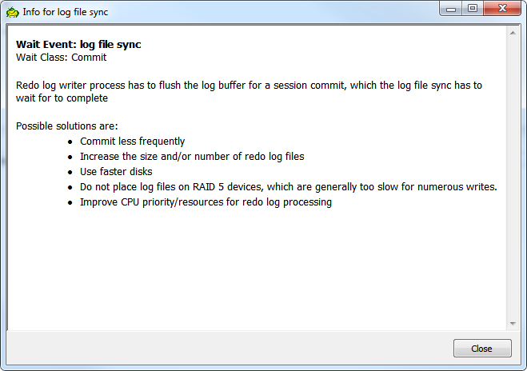
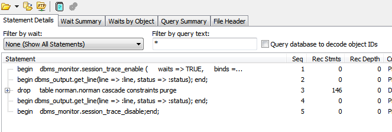
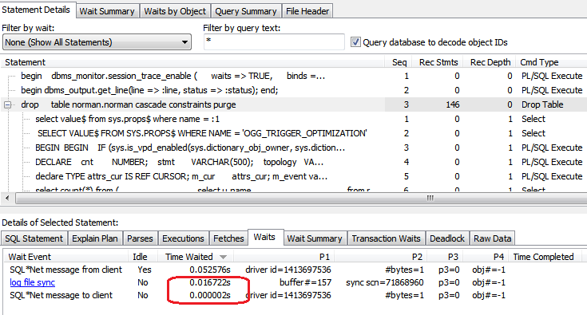
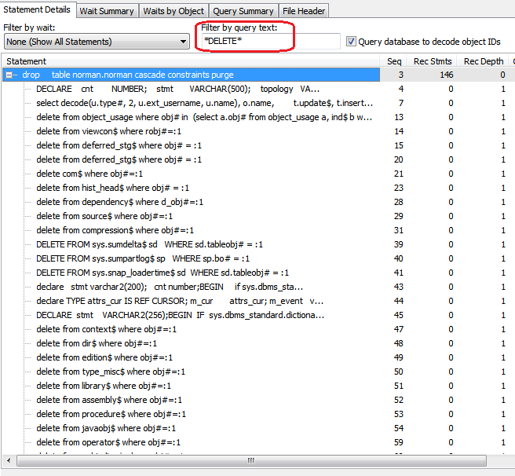
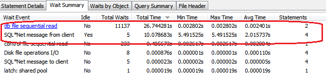
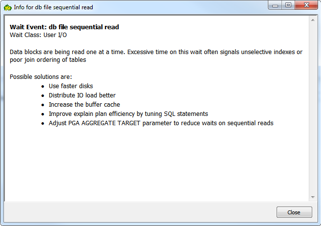
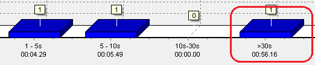
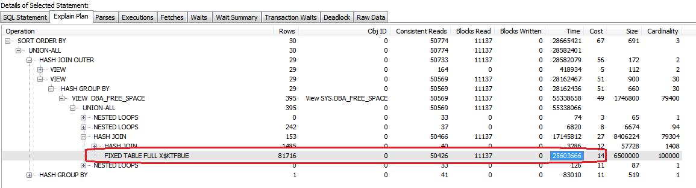

=========================
Toad's Trace File Browser
=========================

************
Introduction
************

The following details are applicable to Toad version 12.1.0.22 as this is the current version that I have. There may be changes in any later versions. Please bear this in mind.

Overview
========

The Trace File Browser, in Toad, is accessed from the ``Database -> Diagnose -> Trace File Browser`` menu option. It allows the DBAs and/or Developers the ability to open a trace file either locally, on the database server or via FTP from a remote server, to analyse the contents.

The raw trace file can be opened in the default external editor if the DBA wishes to consult the raw data in its entirety. The default external editor is set up in toad using ``View -> Toad Options``, click ``Executables`` on the left side and on the right side, you will find a button to assist you to define whichever external editor you wish to use. Or, there's always ``notepad`` I suppose!

The display in Toad has two sections, both with a set of tabbed screens, showing various important parts of the trace file analysis. These are described below. Just about every tab, top or bottom, has a set of options that affect the data displayed on that particular screen.

The following discussion assumes that a trace file has been opened for analysis.

TraceAdjust Utility
===================

You might, if you are a seasoned trace file viewer, notice some additional fields in the various trace file ``PARSE``, ``EXEC``, ``FETCH`` and ``WAIT`` records in the examples elsewhere in this document. For example:

..  code-block:: none

    CLOSE #1016887568:c=0,e=2,dep=2,type=0,tim=1268756.332276,delta=0,dslt=700999,local='2017 Jun 22 08:49:45.700999'
    
These additional fields are added by my own utility `TraceAdjust <https://github.com/NormanDunbar/TraceAdjust>`_ which adjusts a trace file as follows:

-   Adds a decimal point into the ``tim`` field to show full and fractional seconds. ``Tim`` values are in microseconds - at least from Oracle 10g onwards - since some epoch, according to the operating system:

    ..  code-block:: none
    
        tim=1268756.332276
        
-   Adds a ``delta=`` field which shows the number of microseconds difference between this ``tim`` value and the previous ``tim`` value.

    ..  code-block:: none
    
        delta=0
        
-   Adds a ``dslt`` field to show the running ``tim`` deltas since the last timestamp record in the trace file. These timestamp records are the lines that Oracle writes where the actual date and time, plus fractions of a second, are listed, prefixed by '***'. 

    ..  code-block:: none
    
        dslt=700999

    These timestamp records are used by ``TraceAdjust`` to synchronise the ``tim`` values with a real wall clock time, and resemble the following:
    
    ..  code-block:: none
    
        *** 2017-06-22 08:49:45.732
        
-   Adds a ``local`` field to show what the ``tim`` value in this record means when converted to a local timestamp which is adjusted for daylight savings etc.

    ..  code-block:: none
    
        local='2017 Jun 22 08:49:45.700999'
        
The fact that the Toad Trace File Browser copes easily with my added fields shows how well written it has been! Other trace file utilities are, sadly, not so forgiving.

Sorting Results
===============

In all of the table, whether top or bottom of the display, clicking on a column header will allow you to sort on that column. Click once to sort one way (ascending perhaps) and again to reverse the sort order.

The sorted column will display an arrow pointing in the general direction of up or down to indicate the sort order on this column.

Only one column can be sorted.

Wait Details
============

Some of the more common wait events are displayed in the various 'Wait \*' tabs in blue text with underlines. If you double click on these event names, a pop-up window will appear giving some helpful information about the wait in question and how to avoid it.

For example, the following details appear if you double-click a 'log file sync' wait event:

  

******************************
Trace File Analysis - Top Tabs
******************************

The tabs at the top of the screen show details about the overall content of the trace file. The tabs visible here are:

-   Statement Details
-   Wait Summary
-   Waits by Object
-   Query Summary
-   File Header

Statement Details
=================
When you open a trace file, all SQL statements found in the trace file are listed here. 

Filtering
---------

By Wait Event
~~~~~~~~~~~~~

In addition to listing the entire SQL contents of the trace file, certain filters become available when a trace file is open, allowing you to select a wait event to use to filter statements. The drop down will be populated with all the wait events detected within the trace file.

By SQL Text
~~~~~~~~~~~

You may also filter by SQL text, which has a separate text entry area to enter the actual text that you will be searching for. The default here is '\*' and indicates that everything will be displayed.

In this case, you might notice that a SQL statement does not appear to contain the requested text. Check the recursive statements for the affected SQL as there will be one or more of those which *do* contain the requested text.

If you simply search for ``DUAL`` then nothing will be found. You should search for:

-   '\*DUAL' - any statement, or recursive statement which *ends* with the text 'DUAL'.
-   'SELECT\*' - any statement, or recursive statement which *begins* with the text 'SELECT'.
-   '\*MANAGER\*' - any statement, or recursive statement which *contains* the text 'MANAGER'.

Searches are case insensitive, 'DUAL' is the same as 'dual' or 'DuaL' etc.

Wildcards that can be used are:

-   '\*' to represent any number of characters;
-   '?' to represent a single character.

These filters will only show the rows affected by the filter properties, however, be aware that when a top level SQL statement has recursive statements attached - you will see a '+' at the start of the parent statement, then if the recursive statements don't have the waits being filtered, then they will not be seen, even if a '+' exists to indicate recursive statements exist.

Object Id Decoding
------------------

A further option exists to allow you to *query the database to decode object IDs*. If you tick this option, various ``WAIT`` event which have their P1, P2, P3 or P4 holding a object_id will have that object_id converted to details of the object_type, object_name and owner. These are displayed on the statement's 'Waits' tab on the lower part of the screen.

When you tick the option, you are required to select from all existing database connections, or start a new one, so that the correct objects can be decoded.

Options
-------

The right-click context menu in this tab offers the following options:

-   **Print** - prints the list of SQL statements to a printer, which you may choose on the dialogue(s) that follow. There doesn't appear to be a print preview option - at least, not in Toad version 12.1.0.22.
-   **Save** - saves the SQL statement list to a text file. To be brutally honest, the lines are so long and wide, it's not so easy to read - the contents of the current tab in the Trace File Browser is much better laid out. (Other opinions are available!)
-   **Send to Excel** - does *exactly* as it says. The contents of the tab are exported directly to Excel.
-   **Expand All** - expands all SQL statements with recursive SQL to display all the recursive statements.
-   **Collapse All** - collapses and hides all the recursive statements. Only a '+' is shown to indicate which top level statements have recursive SQL statements.
-   **Include Percentages** - displays, or otherwise, the percentage of the total of some counter, that the current statement consumed. For example, a statement may have taken 0.001865 seconds to process (parse, exec, fetch, wait etc) - the percentage shown is the percentage of the whole trace file that this small period of time made up. 
-   **Fix Statement Column** - if checked, the Statement column will be fixed to the left hand side of the window, so that you can always see it if you scroll horizontally to look at the columns that are off to the far right if the display.
-   **Display Full Recursion** - if checked, recursive statements are nested in the tree under their *parent* statements (so you could have multiple levels of nesting).   If unchecked, recursive statements all go directly under the *user* statement in the tree.  

Wait Summary
============

This tab simply lists all the unique wait events that were encountered while processing the trace file. *All* waits encountered will be summarised on this tab. The view will list the total number of each event that occurred and the number of statements in the trace file, that encountered this particular wait event.

Also displayed are the minimum wait, maximum wait and the average wait (the `arithmetic mean <https://en.wikipedia.org/wiki/Mean>`_ average) - but beware of putting too much emphasis on the latter as any number of events with wildly varying wait times can lead to a much lower than normal average as the various values are spread out. You should concentrate on the maximum wait times - those are the problem area, usually.

This tab is a reasonably good place to begin your trace file analysis as it displays in full details, exactly where the process traced spent most of its time waiting.

Options
-------

The right-click context menu in the *top half* of the display offers the following options:

-   **Print** - prints the wait summary details.
-   **Save** - saves the wait summary details.
-   **Send to Excel** - the wait summary details are exported directly to Excel.
-   **Hide Idle Events** - does what it says! It hides all events which have a value of 'Yes' in the 'Idle' column. See the warning above for a good reason *not* to select this option!

When you click on a wait event in the list, the bottom half of the display will list all those statements which encountered the selected wait event. Various details of how badly affected each statement was by the wait, are also seen here.

Options
-------

The right-click context menu in the *lower part* of the display offers the following options:

-   **Print** - prints the statement list.
-   **Save** - saves the statement list.
-   **Send to Excel** - the statement list is exported directly to Excel.
-   **Find Statement on Details Tab** - switches the display to the 'Statement Details' tab, and selects the chosen SQL statement thereon. You can also double-click a wait event to carry out the same process.

Waits by Object
===============

This tab lists waits by object_id. For some trace files, this will only show a single object_id of -1. This is the case when the trace file contains only -1 in each of the P4 wait event parameters. This usually indicates that the waits in the trace file were not related to a particular object - you had no ``DB File sequential read`` wait events, for example, as that wait event *would* have object_ids associated.

Clicking on the object_id in the top half of the display opens up a list of all statements that had the selected object_id in the P4 parameter, in the lower part of the display.

In the lower part, double-click a statement to open in in the 'Statement Details' tab. I suspect this is a missing menu option, as we can see an option to do exactly this in the 'Wait Summary' tab's context menu.

If you have selected a session to 'Query database to decode object IDs' on the 'Statement Details' tab, then the first column here will show the object details as opposed to an object_id.

    **Bug?**: Sorting by object_id, when decoding is not in effect, sorts by the *textual* representation of the object_ids, as opposed to by their *numeric* values. So, 4, 40, 400 etc would appear together.
    
    **Bug Fix**: Resolved in Toad Beta. Will be in the next Toad GA release. (Current date is 23 June 2017).
    

Options
-------

The right-click context menu in this tab, upper and lower halves, offers the following options:

-   **Print** - prints the contents.
-   **Save** - saves the contents.
-   **Send to Excel** - the contents are exported directly to Excel.

Query Summary
=============

The 'Query Summary' tab is possibly incorrectly named. Perhaps it should be 'Trace File Summary' as that is actually what it shows!

There are three main parts to this tab.

-   Trace File Summary
-   Summary Graph
-   Statements List

Trace File Summary
------------------

There is a wealth of detail in this part of the tab. It displays such items as:

-   Total number of statements in the trace file;
-   How many were user level (non-recursive) statements;
-   Hard parse count (try to keep this as low as possible!)
-   ``COMMIT`` and ``ROLLBACK`` counts;
-   First and last timestamps in the file. See below though.
-   Etc.

    **Bug?** I have noticed a few trace files do not get their last timestamp listed, even though it does exist in the file. Toad simply states *<no timestamps in file>* for these traces. Hmm.
    
    **Bug Fix**: Fixed in Toad version 12.11.

This section of the display has a lot of helpful and useful information. 

Options
~~~~~~~

This section of the display does not have a right-click context menu.

Summary Graph
-------------

Pretty pictures! 

Beneath the graph, there is a drop down list of options that control which of the pretty pictures you will see. The left axis shows the number of queries while the bottom axis shows the time/count ranges for each of the options available.

Above each bar of the graph is a small box showing the total number of statements included in this bar's value. This is hugely useful as the 3D effect of the bars and `axes <http://mathworld.wolfram.com/Axis.html>`_ (plural of axis!) can be difficult to work out the exact value.

The graph options, in the drop down, are:

-   **Exec Time** - each bar of the graph shows the number of statements which took certain times to carry out the ``EXEC`` phase of processing the entire statement. You can easily find the most affected statements on this graph and investigate further, if necessary.
-   **Fetch Time** - each bar of the graph shows the number of statements which took certain times to carry out the ``FETCH`` phase of processing the entire statement. You can easily find the most affected statements on this graph and investigate further, if necessary.
-   **Parse Time** - each bar of the graph shows the number of statements which took certain times to carry out the ``PARSE`` phase of processing the entire statement. You can easily find the most affected statements on this graph and investigate further, if necessary.
-   **Wait Time** - each bar of the graph shows the number of statements which took certain times to carry out the ``WAIT`` phase of processing the entire statement. You can easily find the most affected statements on this graph and investigate further, if necessary.
-   **Exec Time + Parse Time + Fetch Time + Wait Time** - The sum of all three above. This graph gives you the total *response time* for the various statements, and response times are really what we as DBAs should be concentrating on, as it is the response time that the users see and suffer from!
-   **Consistent Reads** - each bar of the graph displays the total number of statements which carried out a range of consistent reads in order to process the statement. (See below!)
-   **Current Reads** - each bar of the graph displays the total number of statements which carried out a range of current reads in order to process the statement. (See below!)
-   **Physical Reads** - each bar of the graph displays the total number of statements which carried out a range of physical reads in order to process the statement. (See below!)
-   **Execution Count** - each bar of the graph shows the number of statements which were executed a number of time according to the counts specified on the lower axis of the graph.

    Sadly, I suspect *most* trace files in many companies, will shows that everything was executed once only. Sigh!

In case you are wondering about the three 'Reads' options above, here you are:

Consistent Reads
    A normal reading of a block from the buffer cache. A check will be made if the data needs reconstructing from rollback information to give you a consistent view as of the time that the query started. If so, as many rollback blocks as necessary will be applied - to a clone of the actual data block - to revert the data to the desired point in time.
Current Reads
    Oracle internally (Mostly? Always?) getting data blocks where it does not have to check for the need to reconstruct the data from rollback information. Reading segment header blocks, for example, would be a current read.
Physical Reads
    Where Oracle has to get a block from the I/O subsystem and put it in the cache. This could also be considered a current read I suppose, when it's passed unchanged to the application?

    **Credits**: The above is an amalgamation of various official and unofficial sources on the Web, in Oracle Docs, Ask Tom etc. I have the same problems it appears, trying to remember what these things are! See `Martin Widlake's Blog <https://mwidlake.wordpress.com/2009/06/02/what-are-consistent-gets/>`_ for more info. He did *all* the hard work.

Options
~~~~~~~

You may right-click on the graph and choose to:

-   **Copy to Clipboard** - copies the image of the graph being displayed to the clipboard.
-   **Save** - allows you to save the graph as an image file. Only the Windows 'bmp' format is supported.
-   **Print** - prints the image.
-   **Display User and Recursive Statements Separately** - splits the graph to show separately, the user and recursive statements for each time/count range. 

    **Bug?** This latter option shows a possible bug. When the separate images are being graphed, some of the bars in the graph do not display a (full) list of statements until the images are combined again. I've seen 4 statements show as a completely empty list, and 7 statements show as a single statement in the list. When combined, all statements display correctly.
    
    **Bug Fix**: Fixed in Toad version 12.11.

Statements List
---------------

This section of the display shows details of all the statements which correspond to the clicked bar of the 'Summary Graph' above.

Options
~~~~~~~

The right-click context menu in this section offers the following options:

-   **Print** - prints the statement list.
-   **Save** - saves the statement list.
-   **Send to Excel** - the statement list are exported directly to Excel.
-   **Include Percentages** - shows or hides the percentage of the total trace file for certain of the values displayed here. It's a toggle and remains on or off until changed. 

    It does clear the entire lower section and you have to click on the correct bar again to get the change to display!
    
    It also displays percentages in the lower axis titles for the 'Summary Graphs' section of the display.

Double-click a statement in the list to open it in the 'Statement Details' tab. Another missing menu entry? Perhaps!

File Header
===========

The file header is simply the contents of the first few lines of the trace file being analysed. Everything from the file, down to the first "separator line" is listed. Don't be surprised if you find a rogue ``CLOSE`` statement, for example, listed here. If it is above the first line with a number of consecutive '=' signs, it's considered part of the trace file header.

For example:

..  code-block:: none

    Trace file C:\ORACLEDATABASE\diag\rdbms\prduat\prduat\trace\prduat_ora_5864_JOE.trc
    Oracle Database 11g Enterprise Edition Release 11.2.0.4.0 - 64bit Production
    Windows NT Version V6.2  
    CPU                 : 4 - type 8664, 4 Physical Cores
    Process Affinity    : 0x0x0000000000000000
    Memory (Avail/Total): Ph:6369M/28671M, Ph+PgF:16521M/55295M 
    Instance name: prduat
    Redo thread mounted by this instance: 1
    Oracle process number: 89
    Windows thread id: 5864, image: ORACLE.EXE (SHAD)

    *** 2017-06-22 08:49:45.701
    *** TraceAdjust v0.10: Base Timestamp Adjusted to 'Thu Jun 22 08:49:45 2017'
    *** SESSION ID:(403.1891) 2017-06-22 08:49:45.701
    *** CLIENT ID:() 2017-06-22 08:49:45.701
    *** SERVICE NAME:(PRDUAT) 2017-06-22 08:49:45.701
    *** MODULE NAME:(w3wp.exe) 2017-06-22 08:49:45.701
    *** ACTION NAME:() 2017-06-22 08:49:45.701
     
    CLOSE #1016887568:c=0,e=2,dep=2,type=0,tim=1268756.332276,delta=0,dslt=700999,local='2017 Jun 22 08:49:45.700999'

Options
-------

The right-click context menu in this section has the usual text editor options which allow you to ``select``, ``cut``, ``copy`` etc, from the text displayed in the file header tab. There's nothing much here that will not be familiar already.

*********************************
Trace File Analysis - Bottom Tabs
*********************************

The tabs at the bottom of the display will only be visible when the 'Statement Details' tab is the active tab in the upper part of the display.

The tabs at the bottom of the screen, generally, show details about something that is selected or highlighted in the top set of tabs. Indeed, the lower section of the display is labelled *Details of Selected Statement*.

The tabs displayed in the lower part of the screen are:

-   SQL Statement
-   Explain Plan
-   Parses
-   Executions
-   Fetches
-   Waits
-   Wait Summary
-   Transaction Waits
-   Deadlock
-   Raw data

SQL Statement
=============

When a statement is selected in the upper part of the display, it will have it's details show here, in the lower part.

On the 'SQL Statement' tab, the display is split in two:

-   the Bind Details section is on the left;
-   The Statement Text is on the right.

Bind Details
------------

If the highlighted statement has any bind variables, they are displayed here, with the values used by this execution of the statement. This are will be blank if the statement has no binds.

    **Bug?**: Sometimes the display shows 'NULL' for some (NUMBER?) bind variables and at other times, correctly shows the values. This is a problem in 12.1.0.22 and may be fixed in later versions.
    
    **Bug Fix**: Fixed in Toad version 12.11. Just my luck to be behind the times and stuck on 12.1!

Statement Text
--------------

The full text of the statement is displayed in this section. 

Options
-------

The right-click context menu in the binds section tab offers the following options:

-   **Print** - prints the bind details.
-   **Save** - saves the bind details.
-   **Send to Excel** - the bind details are exported directly to Excel.

The right-click context menu in the binds section tab offers the following options:

-   **Format** - this is a 'sticky' option. You toggle it on or off as desired, and it remains set accordingly, for all subsequent statement views. The SQL text displayed is formatted according to the formatting rules that you have set up (or left as default) in the main Toad editor. (Right-click and select ``Formatting Tools -> Formatter Options``.)

Explain Plan
============
This tab displays the explain plan for the highlighted SQL statement. The difference between what is displayed here, and what might have been displayed for an ``EXPLAIN PLAN FOR...`` for the highlighted statement is simple. This is what *actually* took place. Cardinalities are exact, for example, and not estimated from the optimiser statistics, histograms etc.

Options
-------

The right-click context menu in this tab offers the following options:

-   **Print** - prints the explain plan.
-   **Save** - paves the explain plan.
-   **Send to Excel** - the explain plan is exported directly to Excel.
-   **Expand All** - expands all plan steps to display all the recursive steps.
-   **Collapse All** - collapses and hides all the recursive steps. Only a '+' is shown to indicate which top level steps have recursive steps.

Parses
======

This tab shows you the parse details for the highlighted statement. You are able to see whether this was a hard or soft parse, for example, and the times taken in terms of CPU and elapsed time to parse the SQL. You should be trying to avoid parsing as much as possible - statements should ideally be parsed once, but executed many times.

Parses are like `Highlanders <https://en.wikipedia.org/wiki/Highlander_(film)>`_, *there can be only one* - at any one time.

Options
-------

The right-click context menu in this tab offers the following options:

-   **Print** - prints the parse details.
-   **Save** - saves the parse details.
-   **Send to Excel** - does *exactly* as it says. The parse details are exported directly to Excel.

Executions
==========

This tab shows you the execution details for the highlighted statement. You can see exactly how long the statement took to execute and how many blocks it read to process the displayed number of rows.

Where a statement has recursive SQL, then those totals are included in the totals for the parent SQL statement.

Options
-------

The right-click context menu in this tab offers the following options:

-   **Print** - prints the execution details.
-   **Save** - saves the execution details.
-   **Send to Excel** - the execution details are exported directly to Excel.

Fetches
=======

This tab allows you to view all the individual ``FETCH`` calls for the highlighted SQL statement. You can see how long, in terms of Wall Clock time, each fetch took and how many blocks and rows were processed in each fetch.

Options
-------

The right-click context menu in this tab offers the following options:

-   **Print** - prints the fetch details.
-   **Save** - saves the fetch details.
-   **Send to Excel** - the fetch details are exported directly to Excel.

Waits
=====

This tab allows you to view all the individual ``WAIT`` calls for the highlighted SQL statement. Each wait listed may be from the ``PARSE``, ``EXEC`` or ``FETCH`` phases of executing the statement.

Each listed wait will display whether or not Oracle considers the wait to be an 'idle' one or not. Beware, do not be misled, ``SQL*Net message from client`` is listed as idle, but need not be - this can be the application 'thinking' time when the database sends back some data, which is a performance problem if it takes too long, and *is not* an idle wait.

You will also see the P1, P2, P3 and P4 parameters which you can look up in the *Oracle Reference* manual to see what each one represents for the different wait events. The P4 parameter will sometimes display an object_id, and in those cases checking the option to ``Query database to decode object IDs`` will convert the number displayed into an object type, owner and object_name - once you select or start an appropriate connection to the desired database.

Options
-------

The right-click context menu in this tab offers the following options:

-   **Print** - prints the wait details.
-   **Save** - saves the wait details.
-   **Send to Excel** - the wait details are exported directly to Excel.
-   **Hide Idle Events** - hides all events which have a value of 'Yes' in the 'Idle' column. See the warning above for a good reason *not* to select this option!

Wait Summary
============

This tab simply lists all the unique wait events that were encountered while processing the SQL statement highlighted in the upper part of the display. *All* waits encountered by the statement will be summarised on this tab. The view will list the total number of each event that occurred for this particular statement.

Also displayed are the minimum wait, maximum wait and the average wait (the `arithmetic mean <https://en.wikipedia.org/wiki/Mean>`_ average) - but beware of putting too much emphasis on the latter as any number of events with wildly varying wait times can lead to a much lower than normal average as the various values are spread out. You should concentrate on the maximum wait times - those are the problem area, usually.

Options
-------

The right-click context menu in this tab offers the following options:

-   **Print** - prints the wait summary details.
-   **Save** - saves the wait summary details.
-   **Send to Excel** - the wait summary details are exported directly to Excel.
-   **Hide Idle Events** - hides all events which have a value of 'Yes' in the 'Idle' column. See the warning above for a good reason *not* to select this option!

Transaction Waits
=================

This tab allows you to see if any transaction endings (``COMMIT`` or ``ROLLBACK``) had any waits events following that particular transaction but before the following one. Your trace file may show something similar to the following:

..  code-block:: none

    XCTEND rlbk=1, rd_only=1, tim=32135479409461
    WAIT #0: nam='SQL*Net message to client' ela= 2 driver id=1413697536 #bytes=1 p3=0 obj#=-40016363 tim=32135479409533
    WAIT #0: nam='SQL*Net message from client' ela= 575 driver id=1413697536 #bytes=1 p3=0 obj#=-40016363 tim=32135479410150

Technically, these waits occur *after* the ``COMMIT`` or ``ROLLBACK`` has completed - that's why the ``XCTEND`` line appears *before* the waits, but the way that the Trace File Browser has been written tags them onto the end of the previous statement. They are, technically, waits *between* the just finished statements and the next one, so they could have gone either way.

The cursor id of zero in the waits above indicates something out of the ordinary, as cursor IDs in a trace file are now, from 10g (I think) onward, the actual address in memory for the cursor, and not just some monotonically increasing numeric value - as was the case in previous versions.

If the waits are for a cursor id that is not zero, then they will be accumulated into the correct statement's statistics and will not appear in this particular tab.

Options
-------

The right-click context menu in this tab offers the following options:

-   **Print** - prints the wait details.
-   **Save** - saves the wait details.
-   **Send to Excel** - the wait details are exported directly to Excel.
-   **Hide Idle Events** - hides all wait events which have a value of 'Yes' in the 'Idle' column. See the warning above for a good reason *not* to select this option!

Deadlock
========

There are some details on `ToadWorld <http://www.toadworld.com/products/toad-for-oracle/b/weblog/archive/2013/08/14/toad-12-1-offers-automatic-trace-file-deadlock-detection>`_ on this tab, including a test trace file that you can download and analyse.

When a deadlock (ORA-00060) is detected by Oracle, it dumps a trace of the details to a separate deadlock trace file, or if the session is being traced, to the trace file, then kills off one of the deadlocked transactions.

This tab allows you to see the *entire* deadlock trace from the main trace file. There's a lot of information here. In addition, you will notice that the 'Statement details' tab shows the affected SQL statement highlighted in red, very very red! That's the statement that got binned by Oracle and rolled back.

What is a deadlock? Well, if one session has updated a row with sequence 4 and is attempting to update a row with sequence 8 while another session has already updated the row with sequence 8, but not committed, and is also attempting to update the row worth sequence 4, we have a deadlock. The transactions need not be in the same table, but both sessions (or more, if there's a circular deadlock) are holding something that someone else needs, and is waiting on something that someone else has locked.

For example:

-   Session 1: Delete from table_a where id = 4;
-   Session 2: Update table_b set something = 'A value' where id = 6;
-   Session 1: Update table_b set something_else = 666 where id = 6;
-   Session 2: Update table_a set another_column = 616 where id = 4;

At this point Oracle will detect a deadlock, and one unlucky statement (not the entire transaction, just the statement) will get killed. It is up to the application to handle this and rollback before continuing as appropriate.

There are other kinds of deadlocks, for example, ITL Deadlocks where there is no space to create a new entry in the ITL (Interested Transaction List) in the block header, and no free space (big enough) in the free space of the block to create one either.

Options
-------

The right-click context menu in this section has all the usual text editor options allowing you to ``select``, ``cut``, ``copy`` etc, from the text displayed in the tab's content. 

There's nothing much in the options here that will not be familiar already.

Raw Data
========

All data, from the trace file, for the SQL statement highlighted, will be displayed in this tab, in pretty much it's raw state as you would see it when browsing the raw trace file. The following sections will be seen:

Header
------

This is basically the ``PARSING IN CURSOR`` line taken straight from the trace file. As mentioned above, Toad's Trace File Browser is quite happy to display all the details from my own *TraceAdjust* output files. (See above.)

..  code-block:: none

    PARSING IN CURSOR #1016812856 len=65 dep=0 uid=272 oct=3 lid=272 tim=1268756.404777,delta=1037,dslt=786881,local='2017 Jun 22 08:49:45.786881'

SQL Statement
-------------

The unformatted SQL Statement is displayed. It appears here exactly as it appears in the trace file.

Parse Info
----------

This displays the ``PARSE`` line from the trace file.

..  code-block:: none

    PARSE #1016812856:c=15625,e=12086,p=0,cr=188,cu=0,mis=1,r=0,dep=0,og=1,plh=819305395, tim=1268756.404776,delta=-1,dslt=786880,local='2017 Jun 22 08:49:45.786880'

Exec Info
---------

This displays the ``EXEC`` line from the trace file.

..  code-block:: none

    EXEC #1016812856:c=0,e=31,p=0,cr=0,cu=0,mis=0,r=0,dep=0,og=1,plh=819305395, tim=1268756.404888,delta=112,dslt=786992,local='2017 Jun 22 08:49:45.786992'

Fetch and Wait Info
-------------------

This displays *all* the ``WAIT`` and ``FETCH`` lines from the trace file, for this statement.

..  code-block:: none

    ...
    WAIT #1016812856: nam='SQL*Net message from client' ela= 1902 driver id=1413697536 #bytes=1 p3=0 obj#=-1 tim=1268756.516385,delta=1926,dslt=898489,local='2017 Jun 22 08:49:45.898489'
    WAIT #1016812856: nam='SQL*Net message to client' ela= 1 driver id=1413697536 #bytes=1 p3=0 obj#=-1 tim=1268756.516447,delta=62,dslt=898551,local='2017 Jun 22 08:49:45.898551'
    FETCH #1016812856:c=0,e=65,p=0,cr=0,cu=0,mis=0,r=18,dep=0,og=1,plh=819305395, tim=1268756.516503,delta=56,dslt=898607,local='2017 Jun 22 08:49:45.898607'
    WAIT #1016812856: nam='SQL*Net message from client' ela= 1611 driver id=1413697536 #bytes=1 p3=0 obj#=-1 tim=1268756.518200,delta=1697,dslt=900304,local='2017 Jun 22 08:49:45.900304'
    ...

Stats
-----

This displays *all* the ``STAT`` lines from the trace file, for this statement.

..  code-block:: none

    STAT #1016812856 id=1 cnt=3266 pid=0 pos=1 obj=0 op='SORT ORDER BY (cr=52 pr=0 pw=0 time=7999 us cost=14 size=307004 card=3266)'
    STAT #1016812856 id=2 cnt=3266 pid=1 pos=1 obj=88773 op='TABLE ACCESS FULL FUND_USAGE (cr=52 pr=0 pw=0 time=1798 us cost=13 size=307004 card=3266)'

It is from these lines that the 'Explain Plan' tab is able to build the *exact* plan used by Oracle to access the data for the statement.
    
Options
-------

The right-click context menu in this tab offers the following options:

-   **Print** - prints the wait details.
-   **Save** - saves the wait details.
-   **Send to Excel** - the wait details are exported directly to Excel.
-   **Expand All** - expand all the various sections above in the display.
-   **Collapse All** - collapse all the sections in the display.
   
***********************
A Simple Worked Example
***********************

Introduction
============

Have you ever wondered what Oracle has to do when you do something relatively simple, like dropping a table? How exactly does Oracle go about cleaning up all the triggers, indexes, constraints, dependencies etc that may exist on that table? Read on.

This analysis is purely for interest sake, I'm not interested in solving a performance problems here. That comes later. (See below.)

The trace file is ``Droptable.trc``.

Creating the Objects
--------------------

As the SYS user, I set up a user, **norman** with the following code:

..  code-block:: sql

    create user norman identified by norman;

    grant create session to norman;

    grant create table to norman;

    grant create sequence to norman;

    grant create trigger to norman;

    grant create view to norman;

    grant execute on sys.dbms_monitor to norman;

    grant alter session to norman;

    alter user norman default tablespace users quota unlimited on users;

I then logged in as the norman user, and ran the following commands:

..  code-block:: sql

    create table norman( a number, b date, c varchar2(10));

    alter table norman add constraint norman_pk primary key(a);

    create sequence norman_pk_seq maxvalue 999999999 order nocycle;

    create or replace trigger norman.norman_pk_trg
    before insert
    on norman.norman
    for each row
    begin
        if (:new.a is null) then
            select norman_pk_seq.nextval into :new.a from dual;
        end if;

    end norman_pk_trg;
    / 
       
    create or replace force view norman_view
    (
       some_date,
       some_text
    )
    as
         select b as some_date, c as some_text
           from norman
       order by b desc;

    comment on table norman.norman_view is 
    'this is a comment for a view. The view is norman_view.';

    comment on column norman.norman_view.some_date is 
    'just a date of some kind.';

    comment on column norman.norman_view.some_text is 'a little text.';   

Dropping the Table
------------------

I didn't bother adding any data to the table, I simply started a trace, and dropped the table, as follows:

..  code-block:: sql

    alter session set tracefile_identifier='DROP_TABLE';
    
    begin
        dbms_monitor.session_trace_enable (
          waits => TRUE,
          binds => TRUE);
    end;
    /

    drop table norman.norman cascade constraints purge;  

    begin
        dbms_monitor.session_trace_disable;
    end;
    /    

Trace Analysis
==============

So what happened? Tracing a session is a great way to find out *exactly* what Oracle did. You can also see *exactly* where the response time encountered by the users, was spent.

Load the Trace File
-------------------

Open the trace file browser and load the trace file. Normally, Toad will display the first tab on the upper part of the display, the *Statement Details* tab. Mine looks like this:

Normally, when trying to determine what is causing a long response time, we would have a look at the *Wait Summary* and/or *Waits by Object* tabs to see what was causing the hold up, but in this case we are more interested in what Oracle did. However, feel free to check the tabs for your own interest.

Looking at the *Rec Stmts* column, we see that the ``drop table`` statement carried out 146 recursive statements, just to drop a single table. Actually, it did a lot more than that as you will see if you turn on the right-click option, *Display Full Recursion* - mine jumps to 687 statements now! Best we turn it off again!

Decode Object IDs
-----------------

Make sure that the tick box for *Query database to decode object IDs* is ticked, select the appropriate database connection when prompted, or create a new one. (You *might* need to be SYS here though...) - this helps when looking at the various objects involved in waits and such like.
    
As we are interested in the ``drop table`` statement, select it in the upper part of the display, and on the lower part, click onto the *Waits* tab. The figures displayed are for the ``drop table`` statement *plus all the times etc for the recursive statements involved in dropping the table*. Mine looks like this:

Performance here was not too bad, considering all that Oracle did - only waited for 0.016722 seconds to do the log file sync (commit), then an additional 2 microseconds (2 millionths of a second) to tell me that it was done! 

    **Note**: The object IDs here are all -1. This simply means that there are no specific objects involved in these waits.

You may be aware that when you run any DDL statement, create, drop, alter etc, then Oracle will execute a ``COMMIT`` which will commit all your current uncommitted transactions - this is why you never ever mix DDL and DML in the same script - once you've done the DDL, any DML is ``COMMIT``ed and cannot be rolled back.

Filter Out the Dross
--------------------

Back in the upper section, on the *Statement Details* tab again, it's looking a bit too cluttered for my liking. I'm only really interested in what Oracle ended up ``DELETE``ing to do the actual ``drop table``, so, lets filter everything and keep only those statements with the word 'DELETE' somewhere in the text.

Enter the text ``*DELETE*`` (letter case is not significant here) into the ``filter by query text`` edit box and press enter. The *Statement Details* tab filters the SQL Statements present in the trace file, to only show those which have the word 'DELETE' somewhere in the statement text. For PL/SQL statements, this can be in a comment.

Note that the listed SQL Statements will include:

-   All statements with 'DELETE' anywhere in the text, be this in a comment, the code or elsewhere;
-   All statements with 'DELETEIONS' in the text - because although 'DELETEIONS' is a spelling mistake, it *does* contain the word 'DELETE'! ;-)
-   Any statement with 'DELETES', 'DELETED' etc present in the text.
-   Letter case is not significant.

We are now left with the ``drop table`` statement (the parent) and all the recursive statements containing the text ``DELETE`` in upper, lower or mixed case.

    
And now I'm free to have a look around at all the data that Oracle dropped for me, just to run a single ``drop table`` statement.

*******************************    
Sorting Out a Performance Issue
*******************************    

Introduction
============

I have a query, which I borrowed, stole or wrote by myself\ [1]_\ , to interrogate the free space in a database for both normal data tablespaces and also to work out what available space there is in the TEMP tablespace(s) too. On some databases it seems to run for about 30 seconds, while on others it runs pretty much instantly. Why the difference?

The trace file is ``FreeSpace.trc``.

The Problem Query
=================

This is the query that's giving me problems, I've wrapped in in an ``alter session`` and a couple of calls to ``dbms_monitor`` to get a trace file created.:

..  code-block:: sql

    alter session set tracefile_identifier = 'FREESPACE';

    begin
        dbms_monitor.session_trace_enable(waits => true, binds => true);
    end;
    /
        
    -- Work out tablespace sizes, usages and free space.
    -- Works on 9i and above.
    -- 
    -- Tablespaces at the top of the list need attention most.
    -- Anything over 80% is a warning, 90% is getting critical.
    --
    -- Norman Dunbar.
    with
    space_size as (
        select  tablespace_name,
                count(*) as files, 
                sum(bytes) as bytes,
                sum(
                    case autoextensible
                    when 'YES' then maxbytes
                    else bytes 
                    end
                ) as maxbytes
        from    dba_data_files
        group   by tablespace_name
    ),
    --
    free_space as (
        select  tablespace_name, sum(bytes) as bytes
        from    dba_free_space
        group   by tablespace_name
    )
    --
    select  s.tablespace_name, 
            s.files as data_files,
            round(s.bytes/1024/1024, 2) as size_mb,
            round(nvl(f.bytes, 0) /1024/1024, 2) as free_mb,
            round((nvl(f.bytes, 0) * 100 / s.bytes), 2) as free_pct,
            round((s.bytes - nvl(f.bytes, 0))/1024/1024, 2) as used_mb,
            round((100 - (nvl(f.bytes, 0) * 100 / s.bytes)), 2) as used_pct,        
            round(s.maxbytes/1024/1024, 2) as max_mb,
            round((nvl(s.bytes, 0) * 100 / s.maxbytes), 2) as size_pct_max,
            round((nvl(f.bytes, 0) * 100 / s.maxbytes), 2) as free_pct_max,
            round((s.bytes - nvl(f.bytes, 0)) * 100 / s.maxbytes, 2) as used_pct_max        
    from    space_size s
    left join free_space f
    on      (f.tablespace_name = s.tablespace_name)
    --
    union all
    --
    -- Get actual TEMP usage as opposed to DBA_FREE_SPACE figures.
    select  h.tablespace_name,
            count(*) data_files,
            --
            round(sum(h.bytes_free + h.bytes_used) / 1048576, 2) as size_mb,
            --
            round(sum((h.bytes_free + h.bytes_used) - nvl(p.bytes_used, 0)) / 
            1048576, 2) as free_mb,
            --
            round((sum((h.bytes_free + h.bytes_used) - nvl(p.bytes_used, 0)) / 
            sum(h.bytes_used + h.bytes_free)) * 100, 2) as  Free_pct,
            --
            round(sum(nvl(p.bytes_used, 0))/ 1048576, 2) as used_mb,
            100 - round((sum((h.bytes_free + h.bytes_used) - 
            nvl(p.bytes_used, 0)) / 
            sum(h.bytes_used + h.bytes_free)) * 100, 2) as  used_pct,
            --
            round(sum(decode(f.autoextensible, 
                             'YES', f.maxbytes, 
                             'NO', f.bytes) / 
            1048576), 2) as max_mb,
            --
            round(sum(h.bytes_free + h.bytes_used) * 100 / 
            sum(decode(f.autoextensible, 
                       'YES', f.maxbytes, 
                       'NO', f.bytes)), 2) as  size_pct_max,
            --
            round(sum((h.bytes_free + h.bytes_used) - 
            nvl(p.bytes_used, 0)) * 100 / 
            sum(decode(f.autoextensible, 
                       'YES', f.maxbytes, 
                       'NO', f.bytes)), 2) as  free_pct_max,
            --
            round(sum(nvl(p.bytes_used, 0)) * 100 / 
            sum(decode(f.autoextensible, 
                       'YES', f.maxbytes, 
                       'NO', f.bytes)), 2) as  used_pct_max
            --
    from    sys.v_$TEMP_SPACE_HEADER h,
            sys.v_$Temp_extent_pool p,
            dba_temp_files f 
    where   p.file_id(+) = h.file_id
    and     p.tablespace_name(+) = h.tablespace_name
    and     f.file_id = h.file_id
    and     f.tablespace_name = h.tablespace_name
    group   by h.tablespace_name
    --
    order   by used_pct_max desc;

    begin
        dbms_monitor.session_trace_disable;
    end;

Trace Analysis
==============

Load the Trace File
-------------------    
    
Once the trace file had been opened in the trace file browser and Toad had displayed the *Statement Details* tab, I clicked on the *Wait Summary* tab to see the following:

It looks obvious that we have problems reading blocks from disc, and possibly also getting a response back from the application, Toad in this case. (What else?). The biggest wait is ``db file sequential read``  So we need to concentrate on that first.

You will notice from the image above that the event name is underlined and is blue. We can double click it to get the following:

  
That's helpful, it looks like we are pulling back data blocks one at a time for some reason. Or are we? 

Query Summary
-------------

Switch to the *Query Summary* tab. Using the drop down, lets see where Oracle spent the longest times. Choose, if it's not already chosen, *Exec Time + Parse Time + Fetch Time + Wait Time* or, as I know it, *Response Time*.

  
I see three potential problems, however, as it turns out, the first two are calls to ``dbms_output.get_lines`` so I'm not bothered by those. That leaves a single statement that took over 30 seconds to respond the one on the far right.

Click the bar in the graph for the far right statement, and the culprit will appear beneath the graph. It's my ``with ...`` statement, as I suspected. Double-click the statemnt beneath the grapgh and Toad will open the *Statement Details* tab again, and select the offending statement in the list at the top of the display.

Explain Plan
------------

Look at the explain plan. You may find it wise to close everything down - ``right-click -> Collapse All``. You should now see a single row. The *Time* column shows 28,665,421 micro seconds. 28.67 seconds in real money. That's about right for what I saw when I executed it.

-   Click the '+' at the start of the line to open up again, one row appears - ``UNION-ALL``. A similar time for this, so...
-   Click the '+' at the start of the line, two rows appears - ``HASH JOIN OUTER`` and ``HASH GROUP BY``. The time for the latter is only 83,010 uSeconds, so no problems here. The time for the former is 28,582,079 uSeconds, so we need to dive in there.
-   Click the '+' at the start of the line for ``HASH JOIN OUTER`` to open it. Two ``VIEW`` rows appear. One has a 28,162,436 uSecond response time. 
-   Click the '+' at the start of the line for the ``VIEW`` with the extreme time. One row appears - ``HASH GROUP BY``.
-   Click that one too, to open it. That gives us ``VIEW  DBA_FREE_SPACE ``. Strangely, it has a time of 55,338,658. (55.3 seconds! Something wrong there methinks!)
-   Keep on clicking on the section with the biggest times until, finally we reach the culprit: ``FIXED TABLE FULL X$KTFBUE `` with a 25,603,666 response time.

You can open the rest up if you wish, but nothing comes close to the response time of that full scan.

Now, I know that we have regularly gathered stats on fixed objects and dictionary objects, so there's *obviously* something wrong? And being a X$ table, there's not much I can do - unless ...

    *Insert delay here while I check Oracle Support...*

Bugs!
-----

It seems we have a bug in 11.2.0.4. `Bug 19125876 <https://support.oracle.com/epmos/faces/BugDisplay?_afrLoop=109163696075238&id=19125876&_afrWindowMode=0&_adf.ctrl-state=9eq93xdtt_165>`_ affects 11.20.4 on AIX on Power Systems, but this is Windows. The bug was logged on 30th June 2014, last updated on 26th June 2017, *and is not yet fixed!*

Oracle say that:

..  code-block:: none

    PROBLEM:
    --------
    After applied the 11.2.0.4 patch set, the query from DBA_FREE_SPACE is slow.
    Same query worked fast in 11.2.0.3.
     
    DIAGNOSTIC ANALYSIS:
    --------------------
    Reproduces on few customer databases where 11.2.0.4 patch set was applied.
     
    The problem is FTS on X$KTFBUE:
     
    7586544    7586544    7586544        FIXED TABLE FULL X$KTFBUE
     
    Gather stats does not help.
    EXEC DBMS_STATS.gather_table_stats('SYS', 'X$KTFBUE');
     
    OPTIMIZER_FEATURES_ENABLE='11.2.0.3' does not help.
     
    Empty RECYCLEBIN$ does not help.
     
    The /*+ RULE */ hint does not help.

I feel an SR coming on.

    
-------
    
| Author: Norman Dunbar
| Email: Norman@dunbar-it.co.uk
| Last Updated: June 26 2017

..  [1] Ok, I admit it, I *borrowed* it from Toad and *slightly* modified it for my own use.